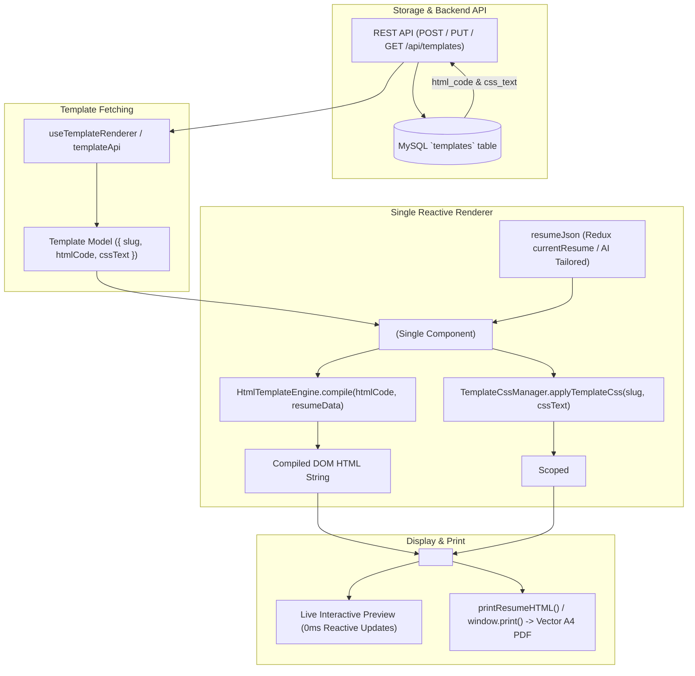

# Resume Template System Specification & API Reference

Comprehensive guide to the Direct HTML + Scoped CSS template architecture, backend REST APIs, the single reactive frontend rendering component, the Handlebars-style data binding engine, and instructions for AI to generate pixel-perfect templates and resume JSON.

---

## 1. System Architecture & Rendering Engine

The FirstImpression template system uses a **Direct HTML + Scoped Vanilla CSS** architecture. Templates are stored as pure HTML markup with dynamic interpolation tags (`{{...}}`) and plain CSS stylesheets scoped exclusively to `.template-${slug}`.

### 1.1 Architecture Flow



### 1.2 Core Engine Modules

1. **`<TemplateRenderer>`** (`src/components/templates/components/TemplateRenderer/TemplateRenderer.jsx`)
   - The **single component** responsible for rendering any resume template.
   - Takes `template` (`{ slug, htmlCode, cssText }`) and `resumeData` (`resumeJson`).
   - Dynamically compiles the HTML with `resumeData` via `HtmlTemplateEngine.compile`.
   - Injects scoped CSS dynamically into `<style id="resume-template-style-[slug]">` in `document.head`.
   - Re-renders reactively in 0ms whenever the user types in `ResumeEditorPanel` or when the AI Resume Assistant (JD Assistant) alters the resume.

2. **`HtmlTemplateEngine`** (`src/components/templates/engine/HtmlTemplateEngine.js`)
   - Fast, zero-dependency HTML template compiler.
   - Evaluates direct & dot-path tokens (`{{personal.name}}`, `{{role}}`, `{{company}}`).
   - Auto-normalizes aliases (`jobTitle` $\leftrightarrow$ `role`, `companyName` $\leftrightarrow$ `company`, `joinDate` $\leftrightarrow$ `startDate`, etc.).
   - Handles conditionals (`{{#if condition}}...{{else}}...{{/if}}`, `{{#unless condition}}...{{/unless}}`).
   - Handles repeating collections (`{{#each experience}}...{{/each}}`, `{{#each skills}}...{{/each}}`, `{{@index}}`, `{{@last}}`, `{{this}}`).

3. **`TemplateCssManager`** (`src/components/templates/engine/TemplateCssManager.js`)
   - Ensures all CSS rules are prefixed with `.template-${slug}` to prevent global stylesheet collisions.
   - Dynamically manages `<style>` tags in `document.head`.

---

## 2. Dynamic HTML Template Specification

Template HTML stored in the database uses standard HTML5 tags and clean, readable Handlebars-style tokens.

### 2.1 Supported Interpolation Tokens

| Token Syntax | Example | Description |
| :--- | :--- | :--- |
| `{{path}}` | `{{personal.name}}` | Renders value from current context or root `resumeData`. |
| `{{this}}` | `<li>{{this}}</li>` | Evaluates to the current item in an array of strings (e.g. inside `highlights` or `items`). |
| `{{#if path}}...{{/if}}` | `{{#if personal.photoUrl}}{{/if}}` | Renders block if `path` is truthy (non-empty string or array with length > 0). |
| `{{#if path}}...{{else}}...{{/if}}` | `{{#if current}}Present{{else}}{{endDate}}{{/if}}` | If-else branch. |
| `{{#unless path}}...{{/unless}}` | `{{#unless @last}}, {{/unless}}` | Inverse of `{{#if}}`. |
| `{{#each path}}...{{/each}}` | `{{#each experience}}<div>{{role}}</div>{{/each}}` | Iterates over an array. Sets item as local context. |
| `{{@index}}` | `{{@index}}` | 0-based index of the current item inside `{{#each}}`. |
| `{{@first}}` | `{{#if @first}}active{{/if}}` | Boolean `true` for first item in `{{#each}}`. |
| `{{@last}}` | `{{#unless @last}}, {{/unless}}` | Boolean `true` for last item in `{{#each}}`. |

### 2.2 Standard HTML Template Structure Example

Any HTML layout (single-column, two-column sidebar, grid cards, header-top) is supported:

```html
<div class="resume-page template-modern-sidebar">
  <div class="modern-columns-layout">
    <!-- Sidebar -->
    <aside class="modern-sidebar">
      <div class="sidebar-header-block">
        {{#if personal.photoUrl}}
          <div class="candidate-avatar">
            
          </div>
        {{/if}}
        <h1 class="candidate-name">{{personal.name}}</h1>
        {{#if personal.title}}<div class="candidate-title">{{personal.title}}</div>{{/if}}
        <div class="candidate-contact">
          {{#if personal.email}}<span class="contact-item"><a href="mailto:{{personal.email}}">{{personal.email}}</a></span>{{/if}}
          {{#if personal.phone}}<span class="contact-item"><a href="tel:{{personal.phone}}">{{personal.phone}}</a></span>{{/if}}
          {{#if personal.location}}<span class="contact-item">{{personal.location}}</span>{{/if}}
          {{#if personal.linkedin}}<span class="contact-item"><a href="{{personal.linkedin}}" target="_blank" rel="noopener noreferrer">{{personal.linkedin}}</a></span>{{/if}}
          {{#if personal.github}}<span class="contact-item"><a href="{{personal.github}}" target="_blank" rel="noopener noreferrer">{{personal.github}}</a></span>{{/if}}
          {{#if personal.website}}<span class="contact-item"><a href="{{personal.website}}" target="_blank" rel="noopener noreferrer">{{personal.website}}</a></span>{{/if}}
        </div>
      </div>

      {{#if skills.length}}
        <div class="sidebar-skills-block">
          <h2 class="block-section-title">Skills & Tools</h2>
          <div class="skills-grouped">
            {{#each skills}}
              <div class="skill-group">
                {{#if category}}<div class="skill-group-name">{{category}}</div>{{/if}}
                <ul class="skills-list">
                  {{#each items}}
                    <li class="skill-badge">{{this}}</li>
                  {{/each}}
                </ul>
              </div>
            {{/each}}
          </div>
        </div>
      {{/if}}

      {{#if education.length}}
        <div class="sidebar-education-block">
          <h2 class="block-section-title">Education</h2>
          {{#each education}}
            <div class="timeline-item">
              <div class="timeline-title">{{degree}} {{#if fieldOfStudy}}in {{fieldOfStudy}}{{/if}}</div>
              <div class="timeline-subtitle">{{institution}}</div>
              <div class="timeline-meta">{{startDate}} – {{endDate}} {{#if location}}| {{location}}{{/if}}</div>
              {{#if gpa}}<div class="education-gpa">GPA: {{gpa}}</div>{{/if}}
            </div>
          {{/each}}
        </div>
      {{/if}}
    </aside>

    <!-- Main Content -->
    <main class="modern-main-content">
      {{#if summary}}
        <section class="main-summary-block">
          <h2 class="block-section-title">Profile Summary</h2>
          <p class="summary-text">{{summary}}</p>
        </section>
      {{/if}}

      {{#if experience.length}}
        <section class="main-experience-block">
          <h2 class="block-section-title">Professional Experience</h2>
          {{#each experience}}
            <div class="timeline-item">
              <div class="timeline-header">
                <div>
                  <span class="timeline-title">{{role}}</span>
                  {{#if company}}<span class="timeline-subtitle"> • {{company}}</span>{{/if}}
                </div>
                <div class="timeline-meta">
                  <span class="timeline-date">{{startDate}} – {{endDate}}</span>
                  {{#if location}}<span class="timeline-location"> | {{location}}</span>{{/if}}
                </div>
              </div>
              {{#if description}}<p class="timeline-description">{{description}}</p>{{/if}}
              {{#if highlights.length}}
                <ul class="timeline-highlights">
                  {{#each highlights}}
                    <li>{{this}}</li>
                  {{/each}}
                </ul>
              {{/if}}
            </div>
          {{/each}}
        </section>
      {{/if}}

      {{#if projects.length}}
        <section class="main-projects-block">
          <h2 class="block-section-title">Key Projects</h2>
          {{#each projects}}
            <div class="timeline-item">
              <div class="timeline-header">
                <div>
                  <span class="timeline-title">
                    {{#if link}}
                      <a href="{{link}}" target="_blank" rel="noopener noreferrer" class="project-link">{{name}}</a>
                    {{else}}
                      {{name}}
                    {{/if}}
                  </span>
                  {{#if technologies.length}}
                    <span class="timeline-subtitle"> | {{#each technologies}}{{this}}{{#unless @last}}, {{/unless}}{{/each}}</span>
                  {{/if}}
                </div>
              </div>
              {{#if description}}<p class="timeline-description">{{description}}</p>{{/if}}
              {{#if highlights.length}}
                <ul class="timeline-highlights">
                  {{#each highlights}}<li>{{this}}</li>{{/each}}
                </ul>
              {{/if}}
            </div>
          {{/each}}
        </section>
      {{/if}}
    </main>
  </div>
</div>
```

---

## 3. Pure Scoped CSS Specification (No Tailwind)

Stored stylesheets MUST be **pure vanilla CSS** (NOT Tailwind utility classes).

### 3.1 Strict CSS Guidelines
1. **Mandatory Scoping**: Every selector must be prefixed with `.template-${slug}`.
2. **Standard Dimensions**: Target `.template-${slug}.resume-page` with `width: 210mm; min-height: 297mm; box-sizing: border-box;`.
3. **No Prohibited Patterns**:
   - NO `<script>` tags.
   - NO `@import` external font rules (fonts are loaded at application level).
   - NO `javascript:` or `expression(...)`.
4. **Print Optimization**: Include `@media print` rules with `page-break-inside: avoid`.

---

## 4. Backend REST API & Validation Rules

### 4.1 Endpoints

| Method | Endpoint | Description |
| :--- | :--- | :--- |
| `POST` | `/api/templates` | Creates a new template. Expects `htmlCode` and `cssText`. |
| `PUT` | `/api/templates/{id}` | Updates a template by UUID or slug. Partial updates supported. |
| `GET` | `/api/templates` | Paginated listing of template summaries. |
| `GET` | `/api/templates/active` | List of all active templates. |
| `GET` | `/api/templates/{idOrSlug}` | Full template details including `htmlCode` and `cssText`. |
| `GET` | `/api/templates/slug/{slug}` | Full template details by slug. |
| `GET` | `/api/templates/{id}/html` | Raw HTML template string (`text/html`). |
| `GET` | `/api/templates/{id}/css` | Raw scoped CSS stylesheet (`text/css`). |
| `DELETE` | `/api/templates/{id}` | Soft deletes template (sets `status = false`). |

### 4.2 Field Requirements for `POST /api/templates`

| Field | Type | Required? | Constraints | Description |
| :--- | :--- | :--- | :--- | :--- |
| `name` | `String` | **Yes** | Max 150 chars | Template display name (e.g. `"Nordic Slate"`). |
| `slug` | `String` | **Yes** | Max 150 chars, regex `^[a-z0-9]+(?:-[a-z0-9]+)*$` | URL-safe unique identifier. |
| `htmlCode` | `String` | **Yes** | Max 500 KB, no `<script>`, no inline handlers | Complete HTML template markup. |
| `cssText` | `String` | **Yes** | Max 500 KB, scoped to `.template-${slug}` | Pure vanilla CSS stylesheet (no Tailwind). |
| `description` | `String` | No | Max 1000 chars | Summary of the design and recommended seniority. |
| `thumbnailUrl` | `String` | No | Max 500 chars | Preview image URL. |
| `category` | `String` | No | Max 50 chars | Category (`"Modern"`, `"Classic"`, `"Executive"`, `"Tech"`). |
| `configJson` | `String` | No | Valid JSON string | Page orientation, margins, or color variables. |
| `version` | `Integer` | No | Default: 1 | Schema version number. |
| `status` | `Boolean` | No | Default: true | Published status. |

---

## 5. Canonical `resumeJson` Data Schema

The resume data schema remains **100% identical and backwards-compatible**. All AI tailoring and JD assistant logic consumes and produces this exact schema:

```json
{
  "personal": {
    "name": "David Sterling",
    "fullName": "David Sterling",
    "title": "Principal Distributed Systems Architect",
    "jobTitle": "Principal Distributed Systems Architect",
    "email": "david.sterling@example.io",
    "phone": "+1 (415) 890-2341",
    "location": "San Francisco, CA",
    "city": "San Francisco",
    "country": "United States",
    "linkedin": "https://linkedin.com/in/david-sterling-architect",
    "github": "https://github.com/davidsterling",
    "website": "https://davidsterling.dev",
    "portfolio": "https://davidsterling.dev",
    "photoUrl": ""
  },
  "summary": "Principal Systems Architect with 11+ years of experience designing high-throughput, fault-tolerant microservices and real-time streaming pipelines. Reduced infrastructure expenditures by $1.4M annually.",
  "experience": [
    {
      "id": "exp-1",
      "role": "Principal Systems Architect",
      "company": "Veloce Cloud Platform",
      "location": "San Francisco, CA",
      "startDate": "Jan 2022",
      "endDate": "Present",
      "current": true,
      "description": "Leading architecture and core infrastructure for global distributed mesh services.",
      "highlights": [
        "Architected multi-region event streaming fabric in Go and Apache Kafka processing 4.2B events daily with 99.999% uptime.",
        "Refactored memory-critical routing daemon, dropping p99 latency from 45ms to 8ms."
      ]
    }
  ],
  "education": [
    {
      "id": "edu-1",
      "degree": "M.S. in Computer Science",
      "fieldOfStudy": "Distributed Systems & Networking",
      "institution": "Georgia Institute of Technology",
      "location": "Atlanta, GA",
      "startDate": "2013",
      "endDate": "2015",
      "gpa": "3.95 / 4.0",
      "highlights": []
    }
  ],
  "skills": [
    {
      "category": "Languages & Systems",
      "items": ["Go", "Rust", "Java", "Python", "TypeScript", "SQL"]
    },
    {
      "category": "Cloud & Infrastructure",
      "items": ["AWS", "Kubernetes", "Docker", "Terraform", "Kafka"]
    }
  ],
  "projects": [
    {
      "id": "proj-1",
      "name": "KubeMesh-Orchestrator",
      "link": "https://github.com/davidsterling/kubemesh-orchestrator",
      "technologies": ["Go", "Kubernetes CRD", "Envoy"],
      "description": "Lightweight open-source service mesh control plane featuring eBPF acceleration.",
      "highlights": ["12,000+ GitHub stars with 40+ corporate contributors."]
    }
  ],
  "certifications": [
    {
      "id": "cert-1",
      "name": "AWS Certified Solutions Architect – Professional",
      "issuer": "Amazon Web Services",
      "date": "2023",
      "url": "https://aws.amazon.com/verification"
    }
  ],
  "languages": [
    {
      "name": "English",
      "level": "Native / Bilingual"
    }
  ],
  "custom": []
}
```

---

## 6. AI Prompt Guide: Generating New Templates (`POST /api/templates`)

Copy and paste this prompt to any LLM (Gemini, Claude, GPT-4) to generate a complete, valid HTML + CSS resume template:

````markdown
You are a Principal Design Systems Architect and Frontend Engineer.
Your task is to create a complete, publication-grade resume template for the FirstImpression resume builder platform.

You must output a single, strictly valid JSON payload matching the `POST /api/templates` schema:

SPECIFICATION REQUIREMENTS:
1. "name": String (max 150 chars, e.g. "Emerald Executive")
2. "slug": String (lowercase alphanumeric with hyphens, e.g. "emerald-executive")
3. "description": String (e.g. "Asymmetric layout with emerald accents and clean typography")
4. "category": String ("Modern", "Executive", "Minimal", "Creative", or "Tech")
5. "version": 1
6. "status": true
7. "htmlCode": String containing complete HTML with Handlebars-style tokens:
   - Root container: <div class="resume-page template-<slug>"> ... </div>
   - Use tokens: {{personal.name}}, {{personal.title}}, {{personal.email}}, {{personal.phone}}, {{personal.location}}, {{personal.linkedin}}, {{personal.github}}, {{personal.website}}
   - Use conditionals: {{#if summary}}...{{/if}}, {{#if personal.photoUrl}}...{{/if}}
   - Use loops: {{#each experience}}...{{/each}}, {{#each education}}...{{/each}}, {{#each skills}}...{{/each}}, {{#each projects}}...{{/each}}, {{#each certifications}}...{{/each}}
   - Inside loops, access: {{role}}, {{company}}, {{startDate}}, {{endDate}}, {{description}}, {{#each highlights}}<li>{{this}}</li>{{/each}}
   - Render links as clickable <a> tags with target="_blank" rel="noopener noreferrer".
8. "cssText": Pure vanilla CSS string (NO Tailwind):
   - EVERY selector MUST start with `.template-<slug>`
   - A4 page dimensions: width: 210mm; min-height: 297mm; box-sizing: border-box;
   - Clean typography, section title borders, skill badges, timeline entries.
   - Prohibited tokens: NO `<script>`, NO `@import`, NO `javascript:`.
   - Include `@media print` rules with `page-break-inside: avoid`.

OUTPUT FORMAT:
Return ONLY the raw JSON object containing the keys: name, slug, description, category, version, status, htmlCode, cssText.
````
