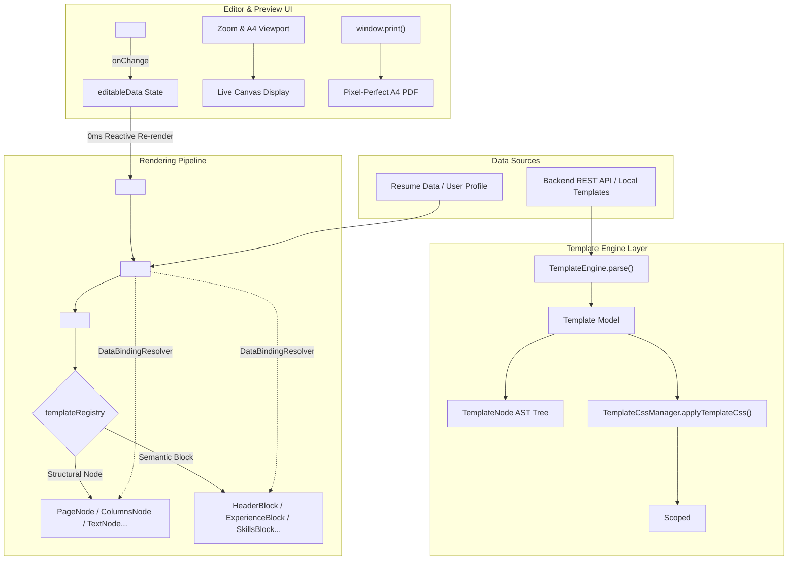

# Resume Template System Specification & API Reference

Comprehensive guide to template architecture, rendering engine, node & block logic, frontend editing, backend validation rules, and the complete zero-value field reference schema.

---

## 1. System Architecture & Rendering Engine

The FirstImpression template system is built upon a **declarative Abstract Syntax Tree (AST)** that completely separates resume content data, layout hierarchy, and scoped styling.

### 1.1 Architecture Flow



### 1.2 Core Engine Modules

1. **`TemplateEngine`** (`src/components/templates/engine/TemplateEngine.js`)
   - Normalizes raw JSON or objects into a typed `Template` model.
   - Depth-first AST tree walker (`traverse`).
   - Validates that the root node is of type `page` and ensures all node IDs are unique.

2. **`DataBindingResolver`** (`src/components/templates/engine/DataBindingResolver.js`)
   - Safely evaluates dot/bracket paths (e.g., `personal.name`, `experience[0].company`).
   - Resolves string interpolation tokens (e.g., `"{personal.city}, {personal.country}"`).
   - Evaluates whether a section has non-empty content before rendering (`hasContent`).

3. **`TemplateCssManager`** (`src/components/templates/engine/TemplateCssManager.js`)
   - Automatically prefixes CSS selectors with `.template-${slug}` to guarantee stylesheet isolation and prevent global style pollution.
   - Injects and manages `<style id="resume-template-style-[slug]">` elements dynamically in `document.head`.

---

## 2. Node & Block Systems

The layout tree is composed of **Structural Nodes** (which define flexbox/grid layout and typography) and **Semantic Blocks** (domain components that bind directly to resume data).

### 2.1 The 15 Allowed Node Types

| Node Type | Purpose | Key Attributes |
| :--- | :--- | :--- |
| `page` | Root sheet container simulating physical A4 (210mm $\times$ 297mm). | `id`, `children`, `classNames` |
| `columns` | Multi-column flexbox wrapper (`display: flex`). | `id`, `children`, `classNames` |
| `column` | Individual column flex child. | `id`, `config: { width }`, `children`, `classNames` |
| `container`| Generic `div` wrapper for layout grouping. | `id`, `children`, `classNames` |
| `row` | Flex row wrapper (`flex-direction: row`). | `id`, `children`, `classNames` |
| `section` | Logical container with `page-break-inside: avoid`. | `id`, `children`, `classNames` |
| `header` | Specialized container node for resume headers. | `id`, `children`, `classNames` |
| `block` | Bridge node that mounts a **Semantic Domain Block**. | `id`, `config: { blockType, title }`, `classNames` |
| `text` | Bound or static paragraph/span element. | `id`, `bind`, `text`, `config: { as }` |
| `heading` | Bound or static heading tag (`h1` through `h6`). | `id`, `bind`, `text`, `config: { level }` |
| `image` | Bound or static profile image / avatar. | `id`, `bind`, `config: { src, alt }` |
| `list` | Bulleted list wrapper (`<ul>`). | `id`, `children`, `classNames` |
| `item` | Individual bullet item (`<li>`). | `id`, `bind`, `text` |
| `divider` | Visual horizontal separating line (`<hr>`). | `id`, `classNames` |
| `spacer` | Vertical spacing element. | `id`, `config: { height }` |

### 2.2 The 9 Allowed Semantic Blocks (`type: "block"`)

| Block Type | Component | Data Bound | Configuration Options |
| :--- | :--- | :--- | :--- |
| `header` | `HeaderBlock` | `personal.name`, `title`, `email`, `phone`, `location`, `linkedin`, `github`, `website`, `photoUrl` | `showPhoto: boolean` |
| `summary` | `SummaryBlock` | `summary` or `personal.bio` | `title: string` |
| `experience` | `ExperienceBlock` | `experience` array (`role`, `company`, `location`, `startDate`, `endDate`, `highlights`) | `title: string` |
| `education` | `EducationBlock` | `education` array (`degree`, `institution`, `startDate`, `endDate`, `gpa`) | `title: string` |
| `skills` | `SkillsBlock` | `skills` (flat strings array or categorized `{ category, items }[]`) | `title: string` |
| `projects` | `ProjectsBlock` | `projects` array (`name`, `link`, `technologies`, `description`, `highlights`) | `title: string` |
| `certifications`| `CertificationsBlock` | `certifications` array (`name`, `issuer`, `date`, `url`) | `title: string` |
| `languages` | `LanguagesBlock` | `languages` array (`name`, `level`) | `title: string` |
| `custom` | `CustomBlock` | Custom user sections | `title: string` |

---

## 3. Frontend Display & Live Editing

### 3.1 Display & Print Simulation
- **A4 Physical Dimensions**: Base styles set `.resume-page` to `width: 210mm` and `min-height: 297mm`.
- **Zoom Stage**: The canvas is scaled using CSS transform:
  ```css
  transform: scale(zoomLevel / 100);
  transform-origin: top center;
  ```
- **Print & PDF Export**: `@page { size: A4 portrait; margin: 0; }` in `template-print.css` strips out shadows, transforms, and hides UI controls (`.print-hide`) to produce a 1:1 pixel-perfect PDF via `window.print()`.

### 3.2 Live Two-Way Editing
- **Reactivity**: `ResumeEditorPanel` sends updates through `onChange(updatedResumeData)`.
- **Zero-latency Re-render**: `TemplatesPage` maintains `editableData`. Updating state triggers immediate re-evaluation in `<TemplateRenderer>` without page reload.
- **Data Isolation**: Resume modifications are saved into `resumeDataJson` of that specific resume document. The user's root account profile remains untouched unless explicitly chosen.

---

## 4. Backend API & Validation Rules

### 4.1 Endpoints
- **Create Template**: `POST /api/templates`
- **Update Template**: `PUT /api/templates/{id}` (Supports both template UUID and unique slug in path)
- **Get All Active**: `GET /api/templates/active`
- **Get by ID or Slug**: `GET /api/templates/{idOrSlug}`
- **Get by Slug**: `GET /api/templates/slug/{slug}`
- **Get CSS**: `GET /api/templates/{id}/css`
- **Get Structure**: `GET /api/templates/{id}/structure`
- **Delete Template**: `DELETE /api/templates/{id}` (Soft deletes / sets status = false)

### 4.2 Update Template Specification (`PUT /api/templates/{id}`)
- **Path Parameter**: `{id}` can be either the template UUID or the slug (e.g., `PUT /api/templates/emerald-executive`).
- **Partial Update**: All payload fields are optional. Only supplied fields are updated; unmentioned fields retain their existing values:
  ```json
  {
    "name": "Updated Template Name",
    "description": "Updated description",
    "thumbnailUrl": "/thumbnails/new-thumb.png",
    "structureJson": "{ ... }",
    "cssText": ".template-slug { ... }",
    "configJson": "{ ... }",
    "category": "Modern",
    "version": 2,
    "status": true
  }
  ```
- **Validation**: If `structureJson` or `cssText` is provided, it must pass the standard `TemplateStructureValidator` and `TemplateCssValidator` checks. Slug cannot be modified via update to prevent breaking existing resumes.

### 4.3 Top-Level Field Validation Rules (Creation)
- **`name`**: Required, non-blank, max 150 characters.
- **`slug`**: Required, non-blank, max 150 characters, must match regex:
  `^[a-z0-9]+(?:-[a-z0-9]+)*$` (e.g., `modern-sidebar`, `minimal-two-col`). Immutable after creation.
- **`description`**: Optional, max 1000 characters.
- **`thumbnailUrl`**: Optional, max 500 characters.
- **`category`**: Optional, max 50 characters (e.g., `Modern`, `Minimal`, `Creative`, `Executive`).
- **`structureJson`**: Required, non-blank valid JSON string.
- **`cssText`**: Required, non-blank string, max 500,000 characters (500 KB).
- **`configJson`**: Optional valid JSON string.
- **`version`**: Integer, default 1.
- **`status`**: Boolean, default true.

### 4.3 AST Structure Validation Rules (`TemplateStructureValidator`)
1. Root node must be a JSON object with `"type": "page"`.
2. Maximum nesting depth is **20 levels**.
3. Every node must have a non-null `"type"` belonging to the allowed 15 types.
4. If `"type": "block"`, the `"block"` attribute or `config.blockType` must be one of the 9 allowed block types.
5. If `"children"` is present, it must be an array of valid node objects.
6. Every node should have a unique `"id"`.

### 4.4 CSS Security & Syntax Rules (`TemplateCssValidator`)
- **Max length**: 500 KB (500,000 characters).
- **Dangerous syntax is strictly blocked**:
  - `<script`
  - `javascript:` or `vbscript:`
  - `expression(...)`
  - `behavior:` or `-moz-binding:`
  - `@import` (prevents external stylesheet injection)
- **Scoping**: All rules must be scoped under `.template-${slug}` (or will be automatically scoped by `TemplateCssManager`).

---

## 5. Complete Zero-Value API Reference Template

Use the following boilerplate when creating new templates. All fields, node types, block types, configuration options, and CSS target classes are included with empty or zero-value placeholders.

### 5.1 Top-Level API JSON Payload (`POST /api/templates`)

```json
{
  "name": "",
  "slug": "",
  "description": "",
  "thumbnailUrl": "",
  "category": "",
  "version": 1,
  "status": true,
  "configJson": "{\"pageSize\":\"\",\"orientation\":\"\",\"margins\":{\"top\":\"\",\"right\":\"\",\"bottom\":\"\",\"left\":\"\"},\"fontFamily\":\"\",\"colors\":{\"primary\":\"\",\"secondary\":\"\",\"accent\":\"\",\"background\":\"\",\"text\":\"\"}}",
  "structureJson": "",
  "cssText": ""
}
```

---

### 5.2 Complete Zero-Value `configJson` Reference

```json
{
  "pageSize": "",
  "orientation": "",
  "margins": {
    "top": "",
    "right": "",
    "bottom": "",
    "left": ""
  },
  "fontFamily": "",
  "fontSize": {
    "base": "",
    "heading": "",
    "subheading": "",
    "caption": ""
  },
  "colors": {
    "primary": "",
    "primaryLight": "",
    "secondary": "",
    "accent": "",
    "accentLight": "",
    "background": "",
    "surface": "",
    "text": "",
    "textMuted": "",
    "border": ""
  }
}
```

---

### 5.3 Complete Zero-Value `structureJson` Reference (All Node & Block Types)

```json
{
  "id": "page-root",
  "type": "page",
  "classNames": "",
  "config": {},
  "children": [
    {
      "id": "node-header-container",
      "type": "header",
      "classNames": "",
      "config": {},
      "children": [
        {
          "id": "block-header",
          "type": "block",
          "classNames": "",
          "config": {
            "blockType": "header",
            "showPhoto": true
          }
        }
      ]
    },
    {
      "id": "node-divider-top",
      "type": "divider",
      "classNames": "",
      "config": {}
    },
    {
      "id": "node-spacer-top",
      "type": "spacer",
      "classNames": "",
      "config": {
        "height": ""
      }
    },
    {
      "id": "node-columns-layout",
      "type": "columns",
      "classNames": "",
      "config": {},
      "children": [
        {
          "id": "node-column-sidebar",
          "type": "column",
          "classNames": "",
          "config": {
            "width": ""
          },
          "children": [
            {
              "id": "node-section-summary",
              "type": "section",
              "classNames": "",
              "config": {},
              "children": [
                {
                  "id": "block-summary",
                  "type": "block",
                  "classNames": "",
                  "config": {
                    "blockType": "summary",
                    "title": ""
                  }
                }
              ]
            },
            {
              "id": "node-section-skills",
              "type": "section",
              "classNames": "",
              "config": {},
              "children": [
                {
                  "id": "block-skills",
                  "type": "block",
                  "classNames": "",
                  "config": {
                    "blockType": "skills",
                    "title": ""
                  }
                }
              ]
            },
            {
              "id": "node-section-languages",
              "type": "section",
              "classNames": "",
              "config": {},
              "children": [
                {
                  "id": "block-languages",
                  "type": "block",
                  "classNames": "",
                  "config": {
                    "blockType": "languages",
                    "title": ""
                  }
                }
              ]
            },
            {
              "id": "node-section-custom",
              "type": "section",
              "classNames": "",
              "config": {},
              "children": [
                {
                  "id": "block-custom",
                  "type": "block",
                  "classNames": "",
                  "config": {
                    "blockType": "custom",
                    "title": ""
                  }
                }
              ]
            }
          ]
        },
        {
          "id": "node-column-main",
          "type": "column",
          "classNames": "",
          "config": {
            "width": ""
          },
          "children": [
            {
              "id": "node-section-experience",
              "type": "section",
              "classNames": "",
              "config": {},
              "children": [
                {
                  "id": "block-experience",
                  "type": "block",
                  "classNames": "",
                  "config": {
                    "blockType": "experience",
                    "title": ""
                  }
                }
              ]
            },
            {
              "id": "node-section-education",
              "type": "section",
              "classNames": "",
              "config": {},
              "children": [
                {
                  "id": "block-education",
                  "type": "block",
                  "classNames": "",
                  "config": {
                    "blockType": "education",
                    "title": ""
                  }
                }
              ]
            },
            {
              "id": "node-section-projects",
              "type": "section",
              "classNames": "",
              "config": {},
              "children": [
                {
                  "id": "block-projects",
                  "type": "block",
                  "classNames": "",
                  "config": {
                    "blockType": "projects",
                    "title": ""
                  }
                }
              ]
            },
            {
              "id": "node-section-certifications",
              "type": "section",
              "classNames": "",
              "config": {},
              "children": [
                {
                  "id": "block-certifications",
                  "type": "block",
                  "classNames": "",
                  "config": {
                    "blockType": "certifications",
                    "title": ""
                  }
                }
              ]
            }
          ]
        }
      ]
    },
    {
      "id": "node-container-footer",
      "type": "container",
      "classNames": "",
      "config": {},
      "children": [
        {
          "id": "node-row-elements",
          "type": "row",
          "classNames": "",
          "config": {},
          "children": [
            {
              "id": "node-custom-heading",
              "type": "heading",
              "bind": "",
              "text": "",
              "classNames": "",
              "config": {
                "level": 2
              }
            },
            {
              "id": "node-custom-text",
              "type": "text",
              "bind": "",
              "text": "",
              "classNames": "",
              "config": {
                "as": "p"
              }
            },
            {
              "id": "node-custom-image",
              "type": "image",
              "bind": "",
              "classNames": "",
              "config": {
                "src": "",
                "alt": ""
              }
            },
            {
              "id": "node-custom-list",
              "type": "list",
              "classNames": "",
              "config": {},
              "children": [
                {
                  "id": "node-custom-item",
                  "type": "item",
                  "bind": "",
                  "text": "",
                  "classNames": "",
                  "config": {}
                }
              ]
            }
          ]
        }
      ]
    }
  ]
}
```

---

### 5.4 Complete Zero-Value `cssText` Reference (All Classes & Selectors)

Replace `<slug>` with your template's slug (e.g. `modern-sidebar`).

```css
/* ==========================================================================
   Template Root & Design Tokens
   ========================================================================== */
.template-<slug> {
  --primary: ;
  --primary-light: ;
  --secondary: ;
  --accent: ;
  --accent-light: ;
  --text-main: ;
  --text-muted: ;
  --bg-page: ;
  --bg-sidebar: ;
  --border-color: ;
  --font-family: ;

  font-family: var(--font-family, inherit);
  color: var(--text-main, #1e293b);
  background-color: var(--bg-page, #ffffff);
}

/* ==========================================================================
   Page & Base Structural Layout
   ========================================================================== */
.template-<slug> .resume-page {
  width: 210mm;
  min-height: 297mm;
  box-sizing: border-box;
  padding: ;
  margin: 0 auto;
}

.template-<slug> .resume-container {
  width: 100%;
  box-sizing: border-box;
}

.template-<slug> .resume-row {
  display: flex;
  flex-direction: row;
  width: 100%;
  gap: ;
}

.template-<slug> .resume-columns {
  display: flex;
  width: 100%;
}

.template-<slug> .resume-column {
  display: flex;
  flex-direction: column;
  min-width: 0;
}

.template-<slug> .resume-section {
  display: flex;
  flex-direction: column;
  page-break-inside: avoid;
  break-inside: avoid;
  margin-bottom: ;
}

.template-<slug> .resume-divider {
  width: 100%;
  border: none;
  border-top: ;
  margin: ;
}

.template-<slug> .resume-spacer {
  width: 100%;
}

/* ==========================================================================
   Header Block Components
   ========================================================================== */
.template-<slug> .block-header {
  display: flex;
}

.template-<slug> .header-container {
  display: flex;
  gap: ;
}

.template-<slug> .header-photo-container {
}

.template-<slug> .avatar-img,
.template-<slug> .header-photo {
  width: ;
  height: ;
  border-radius: ;
  object-fit: cover;
  border: ;
}

.template-<slug> .header-text-group {
}

.template-<slug> .candidate-name,
.template-<slug> .header-name {
  font-size: ;
  font-weight: ;
  color: ;
  margin: ;
}

.template-<slug> .candidate-title,
.template-<slug> .header-role {
  font-size: ;
  font-weight: ;
  color: ;
  margin: ;
}

.template-<slug> .candidate-contact,
.template-<slug> .header-contacts {
  display: flex;
  flex-wrap: wrap;
  gap: ;
  font-size: ;
  color: ;
}

.template-<slug> .contact-item,
.template-<slug> .header-contact-item {
  display: inline-flex;
  align-items: center;
  gap: ;
}

.template-<slug> .contact-item a {
  color: inherit;
  text-decoration: none;
}

/* ==========================================================================
   Section Headings
   ========================================================================== */
.template-<slug> .block-section-title {
  font-size: ;
  font-weight: ;
  text-transform: ;
  letter-spacing: ;
  color: ;
  border-bottom: ;
  padding-bottom: ;
  margin-bottom: ;
}

/* ==========================================================================
   Summary Block
   ========================================================================== */
.template-<slug> .block-summary {
}

.template-<slug> .summary-text {
  font-size: ;
  line-height: ;
  color: ;
}

/* ==========================================================================
   Timeline Items (Experience, Education, Projects, Certifications)
   ========================================================================== */
.template-<slug> .timeline-item,
.template-<slug> .experience-item,
.template-<slug> .education-item,
.template-<slug> .project-item,
.template-<slug> .certification-item {
  margin-bottom: ;
}

.template-<slug> .timeline-header,
.template-<slug> .item-header {
  display: flex;
  justify-content: space-between;
  align-items: baseline;
}

.template-<slug> .timeline-title,
.template-<slug> .item-title {
  font-size: ;
  font-weight: ;
  color: ;
}

.template-<slug> .timeline-subtitle,
.template-<slug> .item-subtitle {
  font-size: ;
  font-weight: ;
  color: ;
}

.template-<slug> .timeline-separator {
  color: ;
}

.template-<slug> .timeline-meta {
  display: flex;
  align-items: center;
  gap: ;
}

.template-<slug> .timeline-date,
.template-<slug> .item-date {
  font-size: ;
  color: ;
}

.template-<slug> .timeline-location,
.template-<slug> .item-location {
  font-size: ;
  color: ;
}

.template-<slug> .timeline-description,
.template-<slug> .item-description {
  font-size: ;
  color: ;
  line-height: ;
  margin-top: ;
}

.template-<slug> .timeline-highlights,
.template-<slug> .bullet-list {
  padding-left: ;
  margin: ;
}

.template-<slug> .timeline-highlights li,
.template-<slug> .bullet-list li {
  font-size: ;
  color: ;
  line-height: ;
  margin-bottom: ;
}

/* ==========================================================================
   Skills Block & Badges
   ========================================================================== */
.template-<slug> .block-skills {
}

.template-<slug> .skills-grouped {
}

.template-<slug> .skill-group {
  margin-bottom: ;
}

.template-<slug> .skill-group-name {
  font-size: ;
  font-weight: ;
  color: ;
  margin-bottom: ;
}

.template-<slug> .skills-list {
  display: flex;
  flex-wrap: wrap;
  gap: ;
  list-style: none;
  padding: 0;
  margin: 0;
}

.template-<slug> .skill-tag,
.template-<slug> .skill-badge {
  display: inline-block;
  font-size: ;
  font-weight: ;
  color: ;
  background-color: ;
  border: ;
  border-radius: ;
  padding: ;
}

/* ==========================================================================
   Languages Block
   ========================================================================== */
.template-<slug> .block-languages {
}

.template-<slug> .languages-list {
}

.template-<slug> .language-item {
  display: flex;
  justify-content: space-between;
  margin-bottom: ;
}

.template-<slug> .language-name {
  font-weight: ;
  font-size: ;
}

.template-<slug> .language-level {
  font-size: ;
  color: ;
}

/* ==========================================================================
   Primitive Typography & Content Elements
   ========================================================================== */
.template-<slug> .resume-heading {
  margin: 0;
  font-weight: ;
  line-height: ;
}

.template-<slug> .resume-text {
  margin: 0;
  line-height: ;
}

.template-<slug> .resume-image-container {
  display: inline-block;
}

.template-<slug> .resume-image {
  max-width: 100%;
  height: auto;
  display: block;
}

.template-<slug> .resume-list {
  padding-left: ;
  margin: ;
}

.template-<slug> .resume-item {
  margin-bottom: ;
}
```

---

### 5.5 Complete Zero-Value Profile Information / Resume Data JSON Reference

Universal data schema consumed by `<TemplateRenderer>` and bound to Semantic Blocks (`HeaderBlock`, `ExperienceBlock`, etc.) and AST Nodes (`bind: "personal.email"`, etc.). Contains all supported personal details, career collections, and metadata with zero/empty values:

```json
{
  "personal": {
    "name": "",
    "fullName": "",
    "title": "",
    "jobTitle": "",
    "email": "",
    "phone": "",
    "location": "",
    "city": "",
    "country": "",
    "linkedin": "",
    "github": "",
    "website": "",
    "portfolio": "",
    "photoUrl": "",
    "avatar": "",
    "bio": ""
  },
  "summary": "",
  "experience": [
    {
      "id": "",
      "role": "",
      "title": "",
      "position": "",
      "company": "",
      "employer": "",
      "location": "",
      "startDate": "",
      "endDate": "",
      "current": false,
      "description": "",
      "highlights": [
        ""
      ]
    }
  ],
  "education": [
    {
      "id": "",
      "degree": "",
      "fieldOfStudy": "",
      "major": "",
      "institution": "",
      "school": "",
      "college": "",
      "location": "",
      "startDate": "",
      "endDate": "",
      "gpa": "",
      "highlights": [
        ""
      ]
    }
  ],
  "skills": [
    {
      "category": "",
      "items": [
        ""
      ]
    }
  ],
  "projects": [
    {
      "id": "",
      "name": "",
      "title": "",
      "link": "",
      "url": "",
      "technologies": [
        ""
      ],
      "startDate": "",
      "endDate": "",
      "description": "",
      "highlights": [
        ""
      ]
    }
  ],
  "certifications": [
    {
      "id": "",
      "name": "",
      "title": "",
      "issuer": "",
      "organization": "",
      "date": "",
      "url": ""
    }
  ],
  "languages": [
    {
      "name": "",
      "language": "",
      "level": "",
      "proficiency": ""
    }
  ],
  "custom": [
    {
      "id": "",
      "title": "",
      "description": "",
      "items": [
        ""
      ]
    }
  ]
}
```

---

## 6. AI Prompt Guide: Creating & Saving Templates (`POST /api/templates`)

This section serves as an operational manual and prompt engineering guide for Large Language Models (LLMs) tasked with designing, architecting, and generating production-ready resume templates for the FirstImpression platform.

### 6.1 Role, Objective & Workflow for AI

When generating templates, the AI must adopt the persona of a **Principal Design Systems & Frontend Engineer**:
1. **Analyze Design Archetype**: Determine layout geometry (single-column, asymmetric 30/70 sidebar, top-header + multi-column, or modular grid cards).
2. **Construct AST (`structureJson`)**: Assemble nodes adhering strictly to the 15 allowed node types and 9 semantic block types.
3. **Draft Scoped CSS (`cssText`)**: Write modern, clean CSS prefixed exclusively with `.template-${slug}`. Guarantee zero global style leakage.
4. **Validate Constraints**: Ensure no prohibited tokens (`<script>`, `@import`, `javascript:`, `expression(`), nesting depth $\le 20$, and valid slug regex.
5. **Serialize Payload**: Output the top-level JSON payload with `structureJson` and `configJson` properly serialized as JSON strings (escaped) as required by the backend REST endpoint.

---

### 6.2 Top-Level Payload Schema & Field Validation Constraints

Every template creation request sent to `POST /api/templates` requires the following fields:

| Field Name | Type | Required? | Max Length / Format | Description & Validation Rules |
| :--- | :--- | :--- | :--- | :--- |
| `name` | `String` | **Yes** | 150 chars | Human-readable title (e.g., `"Executive Slate"`, `"Nordic Minimalist"`). |
| `slug` | `String` | **Yes** | 150 chars | URL-safe identifier matching regex `^[a-z0-9]+(?:-[a-z0-9]+)*$`. Must be unique across the system. |
| `description` | `String` | No | 1000 chars | Summary of the template's visual design, recommended seniority, and target industries. |
| `thumbnailUrl`| `String` | No | 500 chars | Absolute or relative URL to the preview thumbnail image. |
| `category` | `String` | No | 50 chars | One of: `"Modern"`, `"Executive"`, `"Minimal"`, `"Creative"`, `"Academic"`, `"Tech"`. |
| `version` | `Integer`| No | Default: `1` | Schema version number. |
| `status` | `Boolean`| No | Default: `true` | Visibility status (`true` = active/published, `false` = draft/inactive). |
| `configJson` | `String` | No | Valid JSON string | Stringified JSON specifying page geometry, margins, palette, and typography defaults. |
| `structureJson`| `String`| **Yes** | Valid JSON string | Stringified AST root node (`"type": "page"`). Must adhere to the 15 node types. |
| `cssText` | `String` | **Yes** | Max 500,000 chars | Raw CSS stylesheet. All selectors MUST begin with `.template-${slug}`. |

> [!IMPORTANT]
> When submitting to `POST /api/templates`, `structureJson` and `configJson` must be **stringified JSON** (e.g. `"structureJson": "{\"id\":\"page-root\",...}"`). When developing or prompting an AI, the AI can formulate the AST as a nested JSON object first, then serialize it.

---

### 6.3 Rules for `structureJson` (AST) Generation

The AST tells the rendering engine how to layout blocks and structural containers. Follow these strict architectural rules:

1. **Root Node**:
   - Must have `"id": "page-root"`.
   - Must have `"type": "page"`.
   - Children array contains the top-level structural containers.

2. **Column Layouts (`columns` & `column`)**:
   - Use `"type": "columns"` to create a multi-column flex container.
   - Immediate children must be `"type": "column"`.
   - Specify column width inside `config`:
     ```json
     {
       "id": "col-sidebar",
       "type": "column",
       "config": { "width": "32%" },
       "children": [ ... ]
     }
     ```
   - For fluid columns, use `"config": { "flex": "1" }` or `"config": { "width": "68%" }`. Ensure column widths sum to 100% (accounting for column gap if defined).

3. **Sections (`section`)**:
   - Wrap related blocks in a `"type": "section"` node.
   - Sections automatically receive CSS `page-break-inside: avoid` to prevent awkward splitting during PDF printing.

4. **Mounting Semantic Blocks (`block`)**:
   - To mount a domain block (e.g., Experience, Skills), use `"type": "block"`.
   - For 100% dual-compatibility with both the backend validator and the frontend renderer:
     - Set top-level `"block": "<blockType>"` (checked by backend `TemplateStructureValidator`).
     - Set `"config": { "blockType": "<blockType>", "title": "<Custom Section Title>" }` (used by frontend `BlockNode.jsx`).
   - Allowed block types:
     - `"header"`: Profile photo, candidate name, role title, and contact links.
     - `"summary"`: Professional summary / bio.
     - `"experience"`: Work history timeline, responsibilities, bullet points.
     - `"education"`: Degrees, institutions, graduation dates, GPA.
     - `"skills"`: Technical skills, grouped categories, badges/tags.
     - `"projects"`: Project showcases, repositories, live URLs, highlights.
     - `"certifications"`: Professional licenses, credentials, and verification links.
     - `"languages"`: Spoken languages and proficiency levels.
     - `"custom"`: Arbitrary user-defined content sections.

5. **Structural Primitives**:
   - `"type": "divider"`: Renders a horizontal divider `<hr className="resume-divider" />`.
   - `"type": "spacer"`: Renders vertical spacing with `"config": { "height": "16px" }`.
   - `"type": "heading"`: Bound heading with `"config": { "level": 2 }` and `"text": "..."`.
   - `"type": "text"`: Paragraph/span with `"bind": "personal.email"` or static `"text": "..."`.

---

### 6.4 Rules for Scoped `cssText` Generation

The AI must generate robust, self-contained CSS styles that look stunning on screens and translate 1:1 to A4 printed pages:

1. **Mandatory Scoping**:
   - Every single CSS selector MUST begin with `.template-${slug}`.
   - Example for slug `"executive-slate"`:
     ```css
     .template-executive-slate .resume-page { ... }
     .template-executive-slate .block-section-title { ... }
     .template-executive-slate .contact-item a { ... }
     ```

2. **Physical Page & Dimensions**:
   - Target container is `.template-${slug} .resume-page` or `.resume-page.template-${slug}`.
   - Set `width: 210mm; min-height: 297mm; box-sizing: border-box;`.
   - Add clean margins via padding (e.g., `padding: 20mm 18mm;` or `padding: 24px 32px;`).
   - Use background color on the page: `background-color: #ffffff;`.

3. **Flexbox & Columns**:
   - `.template-${slug} .resume-columns`: `display: flex; flex-direction: row; gap: 24px; align-items: stretch;`.
   - `.template-${slug} .resume-column`: `display: flex; flex-direction: column; min-width: 0;`.

4. **Typography & Hierarchy**:
   - Base font: Define on `.resume-page` (e.g., `font-family: 'Inter', -apple-system, sans-serif; font-size: 9.5pt; color: #1e293b; line-height: 1.45;`).
   - Name / Title: `.candidate-name { font-size: 22pt; font-weight: 700; letter-spacing: -0.02em; }`.
   - Section Titles: `.block-section-title { font-size: 11pt; font-weight: 700; text-transform: uppercase; letter-spacing: 0.05em; border-bottom: 1.5px solid #e2e8f0; padding-bottom: 4px; margin-bottom: 12px; }`.

5. **Links & Contact Elements**:
   - Rendered as clickable `<a>` tags.
   - Ensure clean styling:
     ```css
     .template-${slug} .contact-item a,
     .template-${slug} .project-link,
     .template-${slug} .cert-link {
       color: #2563eb;
       text-decoration: none;
       word-break: break-all;
     }
     .template-${slug} .contact-item a:hover,
     .template-${slug} .project-link:hover,
     .template-${slug} .cert-link:hover {
       text-decoration: underline;
     }
     ```

6. **Print & Pagination Optimization**:
   ```css
   @media print {
     .template-${slug} .resume-section,
     .template-${slug} .timeline-item,
     .template-${slug} .skill-group {
       page-break-inside: avoid;
       break-inside: avoid;
     }
   }
   ```

7. **Prohibited Patterns (Backend Reject Traps)**:
   - DO NOT include `<script>` tags.
   - DO NOT include `@import` statements.
   - DO NOT include `javascript:` or `expression(...)`.
   - DO NOT exceed 500,000 characters.

---

### 6.5 Ready-to-Use AI Prompt: "Generate a New Resume Template"

Copy and paste the following prompt to any LLM (Gemini, Claude, GPT-4) to generate a complete, valid template ready for `POST /api/templates`:

````markdown
You are a Principal Design Systems Architect and Frontend Engineer.
Your task is to create a complete, publication-grade resume template for the FirstImpression resume builder platform.

You must output a single, strictly valid JSON payload matching the `POST /api/templates` schema:

SPECIFICATION REQUIREMENTS:
1. "name": String (max 150 chars, e.g. "Nordic Executive")
2. "slug": String (lowercase alphanumeric with hyphens, e.g. "nordic-executive")
3. "description": String (e.g. "Two-column minimalist layout with dark slate accents")
4. "category": String ("Modern", "Executive", "Minimal", "Creative", or "Tech")
5. "version": 1
6. "status": true
7. "configJson": JSON string with { "pageSize": "A4", "orientation": "portrait", "colors": {...}, "fontFamily": "..." }
8. "structureJson": JSON string representing the AST root node:
   - Root must be: { "id": "page-root", "type": "page", "children": [...] }
   - Allowed node types: page, columns, column, container, row, section, header, block, text, heading, image, list, item, divider, spacer
   - Allowed block types: header, summary, experience, education, skills, projects, certifications, languages, custom
   - For every block node, include both `"block": "<type>"` and `"config": { "blockType": "<type>", "title": "<Title>" }`
   - Use a two-column layout with sidebar width: "32%" and main column width: "68%" (or single-column if requested).
9. "cssText": Scoped CSS string:
   - EVERY selector MUST start with `.template-<slug>`
   - A4 sizing: width: 210mm; min-height: 297mm; box-sizing: border-box;
   - Use clean modern typography, section title underlines, tag badges for skills, timeline styling for experience.
   - No prohibited tokens: NO `<script>`, NO `@import`, NO `javascript:`.
   - Include `@media print` rules with `page-break-inside: avoid`.

OUTPUT FORMAT:
Return ONLY the raw JSON object containing the keys: name, slug, description, category, version, status, configJson, structureJson, cssText.
Make sure structureJson and configJson are escaped JSON strings inside the parent JSON object.
````

---

### 6.6 Complete Production-Ready Template Payload Example

Here is a fully verified, valid payload ready to be sent via `curl` or `POST /api/templates`:

```json
{
  "name": "Emerald Executive",
  "slug": "emerald-executive",
  "description": "Sophisticated asymmetric layout with an emerald accent sidebar and clean typography for senior professionals and engineers.",
  "thumbnailUrl": "/thumbnails/emerald-executive.png",
  "category": "Executive",
  "version": 1,
  "status": true,
  "configJson": "{\"pageSize\":\"A4\",\"orientation\":\"portrait\",\"fontFamily\":\"Inter, sans-serif\",\"colors\":{\"primary\":\"#065f46\",\"secondary\":\"#047857\",\"accent\":\"#10b981\",\"background\":\"#ffffff\",\"text\":\"#0f172a\",\"muted\":\"#64748b\"}}",
  "structureJson": "{\"id\":\"page-root\",\"type\":\"page\",\"classNames\":\"emerald-executive-theme\",\"children\":[{\"id\":\"sec-header\",\"type\":\"section\",\"children\":[{\"id\":\"blk-header\",\"type\":\"block\",\"block\":\"header\",\"config\":{\"blockType\":\"header\",\"showPhoto\":false}}]},{\"id\":\"div-top\",\"type\":\"divider\"},{\"id\":\"cols-body\",\"type\":\"columns\",\"children\":[{\"id\":\"col-sidebar\",\"type\":\"column\",\"config\":{\"width\":\"32%\"},\"children\":[{\"id\":\"sec-skills\",\"type\":\"section\",\"children\":[{\"id\":\"blk-skills\",\"type\":\"block\",\"block\":\"skills\",\"config\":{\"blockType\":\"skills\",\"title\":\"Core Competencies\"}}]},{\"id\":\"sec-education\",\"type\":\"section\",\"children\":[{\"id\":\"blk-education\",\"type\":\"block\",\"block\":\"education\",\"config\":{\"blockType\":\"education\",\"title\":\"Education\"}}]},{\"id\":\"sec-languages\",\"type\":\"section\",\"children\":[{\"id\":\"blk-languages\",\"type\":\"block\",\"block\":\"languages\",\"config\":{\"blockType\":\"languages\",\"title\":\"Languages\"}}]},{\"id\":\"sec-certifications\",\"type\":\"section\",\"children\":[{\"id\":\"blk-certifications\",\"type\":\"block\",\"block\":\"certifications\",\"config\":{\"blockType\":\"certifications\",\"title\":\"Certifications\"}}]}]},{\"id\":\"col-main\",\"type\":\"column\",\"config\":{\"width\":\"68%\"},\"children\":[{\"id\":\"sec-summary\",\"type\":\"section\",\"children\":[{\"id\":\"blk-summary\",\"type\":\"block\",\"block\":\"summary\",\"config\":{\"blockType\":\"summary\",\"title\":\"Executive Profile\"}}]},{\"id\":\"sec-experience\",\"type\":\"section\",\"children\":[{\"id\":\"blk-experience\",\"type\":\"block\",\"block\":\"experience\",\"config\":{\"blockType\":\"experience\",\"title\":\"Professional Experience\"}}]},{\"id\":\"sec-projects\",\"type\":\"section\",\"children\":[{\"id\":\"blk-projects\",\"type\":\"block\",\"block\":\"projects\",\"config\":{\"blockType\":\"projects\",\"title\":\"Key Projects & Initiatives\"}}]}]}]}]}",
  "cssText": ".template-emerald-executive.resume-page, .template-emerald-executive .resume-page {\n  width: 210mm;\n  min-height: 297mm;\n  padding: 20mm 18mm;\n  box-sizing: border-box;\n  background: #ffffff;\n  color: #0f172a;\n  font-family: 'Inter', -apple-system, BlinkMacSystemFont, sans-serif;\n  font-size: 9.5pt;\n  line-height: 1.45;\n}\n\n.template-emerald-executive .block-header {\n  margin-bottom: 12px;\n}\n\n.template-emerald-executive .candidate-name {\n  font-size: 24pt;\n  font-weight: 800;\n  color: #065f46;\n  letter-spacing: -0.025em;\n  margin: 0 0 4px 0;\n}\n\n.template-emerald-executive .candidate-title {\n  font-size: 11.5pt;\n  font-weight: 600;\n  color: #047857;\n  margin-bottom: 8px;\n  text-transform: uppercase;\n  letter-spacing: 0.05em;\n}\n\n.template-emerald-executive .header-contacts {\n  display: flex;\n  flex-wrap: wrap;\n  gap: 12px;\n  font-size: 8.5pt;\n  color: #475569;\n}\n\n.template-emerald-executive .contact-item a {\n  color: #047857;\n  text-decoration: none;\n}\n\n.template-emerald-executive .contact-item a:hover {\n  text-decoration: underline;\n}\n\n.template-emerald-executive .resume-divider {\n  border: none;\n  border-top: 2px solid #065f46;\n  margin: 10px 0 16px 0;\n}\n\n.template-emerald-executive .resume-columns {\n  display: flex;\n  flex-direction: row;\n  gap: 20px;\n}\n\n.template-emerald-executive .resume-column {\n  display: flex;\n  flex-direction: column;\n}\n\n.template-emerald-executive .block-section-title {\n  font-size: 10.5pt;\n  font-weight: 700;\n  color: #065f46;\n  text-transform: uppercase;\n  letter-spacing: 0.04em;\n  border-bottom: 1px solid #cbd5e1;\n  padding-bottom: 3px;\n  margin: 0 0 10px 0;\n}\n\n.template-emerald-executive .summary-text {\n  margin: 0 0 14px 0;\n  color: #334155;\n  text-align: justify;\n}\n\n.template-emerald-executive .timeline-item {\n  margin-bottom: 12px;\n  page-break-inside: avoid;\n}\n\n.template-emerald-executive .timeline-header {\n  display: flex;\n  justify-content: space-between;\n  align-items: baseline;\n  margin-bottom: 2px;\n}\n\n.template-emerald-executive .timeline-title {\n  font-weight: 700;\n  color: #0f172a;\n}\n\n.template-emerald-executive .timeline-subtitle {\n  font-weight: 600;\n  color: #047857;\n}\n\n.template-emerald-executive .timeline-meta {\n  font-size: 8.5pt;\n  color: #64748b;\n  white-space: nowrap;\n}\n\n.template-emerald-executive .timeline-description {\n  margin: 2px 0 4px 0;\n  color: #475569;\n}\n\n.template-emerald-executive .timeline-highlights {\n  margin: 4px 0 0 0;\n  padding-left: 16px;\n}\n\n.template-emerald-executive .timeline-highlights li {\n  margin-bottom: 3px;\n  color: #334155;\n}\n\n.template-emerald-executive .skills-grouped {\n  display: flex;\n  flex-direction: column;\n  gap: 8px;\n}\n\n.template-emerald-executive .skill-group-name {\n  font-weight: 600;\n  font-size: 8.5pt;\n  color: #065f46;\n  margin-bottom: 3px;\n}\n\n.template-emerald-executive .skills-list {\n  display: flex;\n  flex-wrap: wrap;\n  gap: 4px;\n  list-style: none;\n  padding: 0;\n  margin: 0 0 6px 0;\n}\n\n.template-emerald-executive .skill-badge {\n  background: #f0fdf4;\n  color: #065f46;\n  border: 1px solid #bbf7d0;\n  padding: 2px 6px;\n  border-radius: 4px;\n  font-size: 8pt;\n  font-weight: 500;\n}\n\n.template-emerald-executive .project-link, \n.template-emerald-executive .cert-link {\n  color: #047857;\n  text-decoration: none;\n  font-weight: 600;\n}\n\n.template-emerald-executive .project-link:hover,\n.template-emerald-executive .cert-link:hover {\n  text-decoration: underline;\n}\n\n@media print {\n  .template-emerald-executive.resume-page {\n    padding: 15mm 15mm;\n  }\n  .template-emerald-executive .resume-section,\n  .template-emerald-executive .timeline-item {\n    page-break-inside: avoid;\n    break-inside: avoid;\n  }\n}"
}
```

---

## 7. AI Prompt Guide: Generating Pixel-Perfect `resumeJson` (`resumeDataJson`)

This section defines the canonical data schema and extraction guidelines for AI models tasked with converting raw candidate profiles, PDFs, or LinkedIn exports into the exact `resumeJson` structure expected by the FirstImpression platform.

### 7.1 Architecture & Resolution Behavior (`DataBindingResolver`)

The frontend rendering engine uses `DataBindingResolver.js` to evaluate expressions and bind data to UI components:
- **Direct Dot/Bracket Pathing**: Resolves paths like `personal.name`, `experience[0].company`, or `skills[1].items`.
- **String Interpolation**: Supports `{personal.city}, {personal.country}` tokens in text nodes.
- **Null Safety**: Non-existent fields gracefully resolve to `null` or empty strings without throwing runtime exceptions.
- **Multi-Key Fallback Aliases**: Block components check multiple standard property names for maximum fault tolerance.

---

### 7.2 Complete `resumeJson` Specification & Field Glossary

To ensure every component renders with 100% fidelity, adhere to the primary keys and supported aliases detailed below:

#### 1. `personal` (Object — Contact & Identity)
| Field | Type | Supported Aliases | Formatting Rules |
| :--- | :--- | :--- | :--- |
| `name` | `string` | `fullName` | Candidate's full name (e.g. `"Alexander Vance"`). |
| `title` | `string` | `jobTitle` | Professional target title (e.g. `"Staff Software Engineer"`). |
| `email` | `string` | — | Clean email string. Rendered with `mailto:`. |
| `phone` | `string` | `phoneNo` | Formatted phone number (e.g. `"+1 (555) 234-5678"`). |
| `location` | `string` | `[city, country]` | City and State/Country (e.g. `"San Francisco, CA"`). |
| `linkedin` | `string` | `linkedinUrl` | Full URL (e.g. `"https://linkedin.com/in/alexandervance"`). |
| `github` | `string` | `githubUrl` | Full URL (e.g. `"https://github.com/alexvance"`). |
| `website` | `string` | `portfolio`, `portfolioUrl` | Full URL (e.g. `"https://alexvance.dev"`). |
| `photoUrl` | `string` | `avatar` | Absolute image URL or base64 data URI (optional). |
| `bio` | `string` | `summary` | Fallback bio if top-level summary is omitted. |

#### 2. `summary` (String — Executive Profile)
High-impact 2–4 sentence summary highlighting years of experience, core tech stack, domain expertise, and signature achievements.

#### 3. `experience` / `workExperiences` (Array of Objects)
| Field | Type | Supported Aliases | Formatting Rules |
| :--- | :--- | :--- | :--- |
| `id` | `string` \| `number` | — | Unique identifier (e.g. `"exp-1"`). |
| `role` | `string` | `jobTitle`, `title`, `position` | Exact position title (e.g. `"Lead Backend Architect"`). |
| `company` | `string` | `companyName`, `employer` | Organization name (e.g. `"Stripe"`). |
| `location` | `string` | — | Job location or `"Remote"` (e.g. `"New York, NY (Remote)"`). |
| `startDate`| `string` | `joinDate` | Month & Year (e.g. `"Mar 2021"`). |
| `endDate` | `string` | — | Month & Year (e.g. `"Present"` or `"Jan 2024"`). |
| `current` | `boolean`| — | Set `true` if currently employed; renders `"Present"`. |
| `description` | `string` | — | 1-line department or product context. |
| `highlights`| `string[]`| `bullets`, `responsibilities`, `technologies` | Array of 3–5 bullet points starting with strong action verbs. |

#### 4. `education` (Array of Objects)
| Field | Type | Supported Aliases | Formatting Rules |
| :--- | :--- | :--- | :--- |
| `id` | `string` \| `number` | — | Unique identifier (e.g. `"edu-1"`). |
| `degree` | `string` | — | Degree name (e.g. `"B.S."`, `"Master of Science"`). |
| `fieldOfStudy` | `string` | `major` | Major / Focus (e.g. `"Computer Science & Mathematics"`). |
| `institution` | `string` | `school`, `college`, `instituteName` | University name (e.g. `"Carnegie Mellon University"`). |
| `location` | `string` | — | University city/state (e.g. `"Pittsburgh, PA"`). |
| `startDate`| `string` | — | Year or Month Year (e.g. `"2016"`). |
| `endDate` | `string` | — | Year or Month Year (e.g. `"2020"`). |
| `gpa` | `string` | — | Optional GPA string (e.g. `"3.92 / 4.0"`). |
| `highlights`| `string[]`| — | Honors, awards, or select coursework. |

#### 5. `skills` (Array of Categorized Objects OR Flat Strings)
- **Categorized Format (Highly Recommended for Cleanest Layout)**:
  ```json
  [
    {
      "category": "Languages & Core",
      "items": ["TypeScript", "Go", "Python", "Rust", "SQL"]
    },
    {
      "category": "Cloud & Infrastructure",
      "items": ["AWS", "Kubernetes", "Docker", "Terraform", "Kafka"]
    }
  ]
  ```
- **Flat Format (Supported)**:
  ```json
  ["React", "Node.js", "GraphQL", "PostgreSQL", "Docker"]
  ```

#### 6. `projects` (Array of Objects)
| Field | Type | Supported Aliases | Formatting Rules |
| :--- | :--- | :--- | :--- |
| `id` | `string` \| `number` | — | Unique identifier (e.g. `"proj-1"`). |
| `name` | `string` | `title` | Project title (e.g. `"Distributed Event Engine"`). |
| `link` | `string` | `projectLink`, `url`, `repoUrl`, `githubUrl` | Full clickable URL (e.g. `"https://github.com/user/project"`). |
| `technologies` | `string[]` | `techStack`, `tools` | Array of key tech used (e.g. `["Go", "gRPC", "Redis"]`). |
| `description` | `string` | — | 1-2 sentence overview of what the project solves. |
| `highlights` | `string[]` | `bullets` | 1–3 bullet points highlighting technical wins or metrics. |

#### 7. `certifications` (Array of Objects)
| Field | Type | Supported Aliases | Formatting Rules |
| :--- | :--- | :--- | :--- |
| `id` | `string` \| `number` | — | Unique identifier. |
| `name` | `string` | `title` | Credential name (e.g. `"AWS Certified Solutions Architect"`). |
| `issuer` | `string` | `issuedBy`, `organization` | Issuing authority (e.g. `"Amazon Web Services"`). |
| `date` | `string` | `issueDate` | Year or Month Year (e.g. `"2023"`). |
| `url` | `string` | `link`, `certificateUrl`, `credentialUrl` | Clickable verification URL. |

#### 8. `languages` (Array of Objects or Strings)
| Field | Type | Supported Aliases | Formatting Rules |
| :--- | :--- | :--- | :--- |
| `name` | `string` | `language` | Language name (e.g. `"English"`, `"German"`). |
| `level` | `string` | `proficiency` | Fluency (e.g. `"Native"`, `"Professional Working"`, `"Fluent"`). |

---

### 7.3 Rules for Pixel-Perfect Content Crafting

When generating or polishing resume content, the AI must enforce the following quality benchmarks:

1. **Clickable, Unbroken Full URLs**:
   - Always output fully qualified URLs (`https://linkedin.com/in/...`, `https://github.com/...`).
   - The platform components automatically render these as clickable external links (`target="_blank"`, `rel="noopener noreferrer"`).
   - Never output truncated or vanity-only text in URL fields (e.g., avoid `"linkedin/in/alex"`; use `"https://linkedin.com/in/alex"`).

2. **Action-Oriented, Quantifiable Bullets (The Google XYZ Formula)**:
   - Structure bullets as: *Accomplished [X], as measured by [Y], by doing [Z]*.
   - Start with punchy past-tense action verbs (*Architected, Accelerated, Reduced, Spearheaded, Engineered*).
   - Include concrete metrics (*"reduced API latency by 42%"*, *"scaled cluster to 10M+ daily events"*, *"saved $180K annually"*).

3. **Zero-Spillover A4 Content Budgeting**:
   - For a **1-page resume**: Limit experience to 2–3 roles with 3–4 bullets each, 2 projects with 2 bullets each, and 3 skill groups with 5–7 items each.
   - For a **2-page resume**: Up to 4–5 roles with 4–5 bullets each, 3–4 projects, and full education/certifications.
   - Never include generic filler or redundant responsibilities (*"responsible for attending daily standups"*).

4. **Zero Value & Null Handling**:
   - NEVER output literal strings like `"null"`, `"None"`, `"N/A"`, or `"undefined"`.
   - If a field has no data, use an empty string `""` or omit the property entirely.
   - If an entire section has no entries (e.g., no certifications), provide an empty array `[]` so the block automatically hides itself.

---

### 7.4 Ready-to-Use AI Prompt: "Extract & Generate Pixel-Perfect `resumeJson`"

Copy and paste this prompt to convert any raw resume text or LinkedIn export into `resumeJson`:

````markdown
You are an Executive Resume Strategist and Technical Recruiter.
Analyze the provided candidate background and generate a pixel-perfect `resumeJson` object matching the FirstImpression schema.

SCHEMA SPECIFICATION:
{
  "personal": {
    "name": "Full Name",
    "title": "Exact Target Career Title",
    "email": "name@example.com",
    "phone": "+1 (555) 000-0000",
    "location": "City, State/Country",
    "linkedin": "https://linkedin.com/in/full-url",
    "github": "https://github.com/full-url",
    "website": "https://full-portfolio-url.com"
  },
  "summary": "High-impact 2-3 sentence executive profile with signature skills, domain authority, and quantifiable impact.",
  "experience": [
    {
      "id": "exp-1",
      "role": "Position Title",
      "company": "Company Name",
      "location": "City, State or Remote",
      "startDate": "Mon Year",
      "endDate": "Present",
      "current": true,
      "description": "Brief 1-sentence product/team context",
      "highlights": [
        "Accomplished [X] by doing [Z], resulting in [Y metric].",
        "Engineered [system] using [technologies], cutting load times by 35%."
      ]
    }
  ],
  "education": [
    {
      "id": "edu-1",
      "degree": "Degree Level",
      "fieldOfStudy": "Major / Field",
      "institution": "University Name",
      "location": "City, State",
      "startDate": "Year",
      "endDate": "Year",
      "gpa": "3.85 / 4.0",
      "highlights": ["Honors or awards"]
    }
  ],
  "skills": [
    {
      "category": "Category Name",
      "items": ["Skill 1", "Skill 2", "Skill 3"]
    }
  ],
  "projects": [
    {
      "id": "proj-1",
      "name": "Project Name",
      "link": "https://live-or-github-url.com",
      "technologies": ["React", "FastAPI", "PostgreSQL"],
      "description": "1-sentence problem & solution overview.",
      "highlights": [
        "Key architectural achievement or user adoption metric."
      ]
    }
  ],
  "certifications": [
    {
      "id": "cert-1",
      "name": "Certification Title",
      "issuer": "Issuing Body",
      "date": "Year",
      "url": "https://credential-verification-url.com"
    }
  ],
  "languages": [
    {
      "name": "Language",
      "level": "Native / Fluent / Professional"
    }
  ]
}

STRICT CONSTRAINTS:
- Links MUST be complete, valid URLs starting with https://.
- Never output "null", "N/A", or "None". Use empty arrays [] or omit absent sections.
- Categorize skills logically (Languages, Frameworks, Cloud/DevOps, Databases/Tools).
- Output ONLY the raw, strictly valid JSON object.
````

---

### 7.5 Complete Production `resumeJson` Example

```json
{
  "personal": {
    "name": "David Sterling",
    "fullName": "David Sterling",
    "title": "Principal Distributed Systems Architect",
    "jobTitle": "Principal Distributed Systems Architect",
    "email": "david.sterling@example.io",
    "phone": "+1 (415) 890-2341",
    "location": "San Francisco, CA",
    "city": "San Francisco",
    "country": "United States",
    "linkedin": "https://linkedin.com/in/david-sterling-architect",
    "github": "https://github.com/davidsterling",
    "website": "https://davidsterling.dev",
    "portfolio": "https://davidsterling.dev",
    "photoUrl": ""
  },
  "summary": "Principal Systems Architect with 11+ years of experience designing high-throughput, fault-tolerant microservices and real-time streaming pipelines. Pioneer of cloud-native migrations handling 500K+ writes/sec at sub-10ms p99 latency while reducing infrastructure expenditures by $1.4M annually.",
  "experience": [
    {
      "id": "exp-1",
      "role": "Principal Systems Architect",
      "company": "Veloce Cloud Platform",
      "location": "San Francisco, CA",
      "startDate": "Jan 2022",
      "endDate": "Present",
      "current": true,
      "description": "Leading architecture and core infrastructure for global distributed mesh services.",
      "highlights": [
        "Architected multi-region event streaming fabric in Go and Apache Kafka processing 4.2B events daily with 99.999% uptime.",
        "Refactored memory-critical routing daemon, dropping p99 latency from 45ms to 8ms and slashing compute instance count by 38%.",
        "Spearheaded company-wide zero-trust network transition across 450+ microservices using Envoy proxies and SPIFFE/SPIRE.",
        "Mentored 18 senior engineers and authored 12 foundational architectural RFCs adopted across all product squads."
      ]
    },
    {
      "id": "exp-2",
      "role": "Staff Backend Engineer",
      "company": "Nexus Financial Technologies",
      "location": "New York, NY (Remote)",
      "startDate": "Jun 2018",
      "endDate": "Dec 2021",
      "current": false,
      "description": "Core payment settlement engine team.",
      "highlights": [
        "Designed real-time settlement reconciliation ledger in Java and CockroachDB, processing $18B+ in annual transaction volume.",
        "Re-engineered idempotent idempotency barrier to eliminate duplicate charge incidents, saving an estimated $420K in dispute costs.",
        "Created custom Kubernetes operator for automated database shard rebalancing, trimming scheduled maintenance windows from 2 hours to 0 downtime."
      ]
    },
    {
      "id": "exp-3",
      "role": "Senior Software Engineer",
      "company": "Helix Data Analytics",
      "location": "Boston, MA",
      "startDate": "Aug 2015",
      "endDate": "May 2018",
      "current": false,
      "description": "High-volume analytical data pipeline team.",
      "highlights": [
        "Built distributed ingestion pipeline ingesting 120 TB daily telemetry data using Spark Streaming and Apache Parquet on AWS S3.",
        "Decreased ETL batch query processing times by 65% by implementing column-level dictionary encoding and bloom filters."
      ]
    }
  ],
  "education": [
    {
      "id": "edu-1",
      "degree": "M.S. in Computer Science",
      "fieldOfStudy": "Distributed Systems & Networking",
      "institution": "Georgia Institute of Technology",
      "location": "Atlanta, GA",
      "startDate": "2013",
      "endDate": "2015",
      "gpa": "3.95 / 4.0",
      "highlights": [
        "Graduate Research Assistant in Cloud Computing and Parallel Computing Systems",
        "Co-authored 2 published papers on consensus protocol latency under packet degradation"
      ]
    },
    {
      "id": "edu-2",
      "degree": "B.S. in Computer Engineering",
      "fieldOfStudy": "Computer Engineering",
      "institution": "University of Michigan",
      "location": "Ann Arbor, MI",
      "startDate": "2009",
      "endDate": "2013",
      "gpa": "3.88 / 4.0",
      "highlights": [
        "Summa Cum Laude Honors",
        "Eta Kappa Nu (IEEE Honor Society) Member"
      ]
    }
  ],
  "skills": [
    {
      "category": "Languages & Systems",
      "items": [
        "Go",
        "Rust",
        "Java (17+)",
        "Python",
        "TypeScript",
        "SQL",
        "C++"
      ]
    },
    {
      "category": "Distributed Systems & Cloud",
      "items": [
        "Apache Kafka",
        "Kubernetes",
        "Docker",
        "Terraform",
        "AWS (EKS, MSK, RDS)",
        "Envoy",
        "gRPC",
        "GraphQL"
      ]
    },
    {
      "category": "Storage & Databases",
      "items": [
        "PostgreSQL",
        "CockroachDB",
        "Redis",
        "Apache Cassandra",
        "Elasticsearch",
        "Prometheus",
        "ClickHouse"
      ]
    }
  ],
  "projects": [
    {
      "id": "proj-1",
      "name": "KubeMesh-Orchestrator",
      "link": "https://github.com/davidsterling/kubemesh-orchestrator",
      "technologies": [
        "Go",
        "Kubernetes CRD",
        "Envoy",
        "eBPF"
      ],
      "description": "Lightweight open-source service mesh control plane featuring eBPF socket acceleration.",
      "highlights": [
        "Achieved 12,000+ GitHub stars with 40+ corporate contributors worldwide.",
        "Demonstrated 2.4x lower latency compared to standard Istio iptables data planes."
      ]
    },
    {
      "id": "proj-2",
      "name": "Raft-Consensus-Engine",
      "link": "https://github.com/davidsterling/raft-go-consensus",
      "technologies": [
        "Go",
        "Raft Protocol",
        "Jepsen Testing"
      ],
      "description": "Production-hardened Raft consensus implementation verified with rigorous Jepsen partition tests.",
      "highlights": [
        "Survives network splits and clock drift with zero state divergence."
      ]
    }
  ],
  "certifications": [
    {
      "id": "cert-1",
      "name": "AWS Certified Solutions Architect – Professional",
      "issuer": "Amazon Web Services",
      "date": "2023",
      "url": "https://aws.amazon.com/verification"
    },
    {
      "id": "cert-2",
      "name": "Certified Kubernetes Administrator (CKA)",
      "issuer": "Cloud Native Computing Foundation (CNCF)",
      "date": "2022",
      "url": "https://www.cncf.io/certification/cka/"
    }
  ],
  "languages": [
    {
      "name": "English",
      "level": "Native / Bilingual"
    },
    {
      "name": "German",
      "level": "Professional Working (B2)"
    }
  ]
}
```

---

## 8. Pixel-Perfect Layout & CSS Best Practices for AI Model Prompts

Use this reference to ensure every generated template renders flawlessly across viewports, zoom levels, and A4 print outputs.

### 8.1 Complete CSS Selector Dictionary

All selectors must be scoped with `.template-${slug}`:

```css
/* Container & Structural Layout */
.template-<slug>.resume-page              /* The A4 canvas sheet */
.template-<slug> .resume-columns           /* Flex row container */
.template-<slug> .resume-column            /* Column container */
.template-<slug> .resume-section           /* Section with page-break-inside: avoid */
.template-<slug> .resume-divider           /* Styled horizontal rule (<hr>) */
.template-<slug> .resume-spacer            /* Vertical spacer */

/* Header Block */
.template-<slug> .block-header             /* Header container */
.template-<slug> .candidate-avatar         /* Profile photo wrapper */
.template-<slug> .avatar-img               /* Profile image element */
.template-<slug> .candidate-name           /* Candidate full name (h1) */
.template-<slug> .candidate-title          /* Target career role/title */
.template-<slug> .header-contacts          /* Contact container (flex row/wrap) */
.template-<slug> .contact-item             /* Individual contact item span */
.template-<slug> .contact-item a           /* Clickable contact link (email, tel, web) */

/* Block Common Elements */
.template-<slug> .block-section-title      /* Section heading (h2) */

/* Summary Block */
.template-<slug> .block-summary            /* Summary container */
.template-<slug> .summary-text             /* Paragraph text */

/* Experience / Education / Projects / Certs Timeline */
.template-<slug> .timeline-item            /* Timeline entry container */
.template-<slug> .timeline-header          /* Top line of timeline entry (flex) */
.template-<slug> .timeline-title           /* Role / Degree / Project title */
.template-<slug> .timeline-subtitle        /* Company / Institution / Issuer */
.template-<slug> .timeline-meta            /* Right-aligned date & location */
.template-<slug> .timeline-date            /* Date range text */
.template-<slug> .timeline-location        /* Location text */
.template-<slug> .timeline-description     /* Brief role / project summary */
.template-<slug> .timeline-highlights      /* Highlights list (<ul>) */
.template-<slug> .timeline-highlights li   /* Individual bullet point */

/* Skills Block */
.template-<slug> .block-skills             /* Skills container */
.template-<slug> .skills-grouped           /* Wrapper for categorized skills */
.template-<slug> .skill-group              /* Single category group container */
.template-<slug> .skill-group-name         /* Category name heading */
.template-<slug> .skills-list              /* Badge list (<ul>) */
.template-<slug> .skill-badge              /* Individual pill/badge (<li>) */

/* Projects & Certs Links */
.template-<slug> .project-link             /* Project clickable title (<a>) */
.template-<slug> .cert-link                /* Certification clickable credential (<a>) */

/* Languages Block */
.template-<slug> .block-languages          /* Languages container */
.template-<slug> .languages-list           /* List of languages */
.template-<slug> .language-item            /* Individual language row */
.template-<slug> .language-name            /* Language name */
.template-<slug> .language-level           /* Proficiency level text */
```

---

### 8.2 A4 Page Budgeting & Zero-Spillover Architecture

A standard A4 page is **210mm $\times$ 297mm** ($\approx 794\text{px} \times 1123\text{px}$ at 96 DPI). When building a 1-page resume template, the total combined height of all elements, margins, and gaps must not exceed 297mm.

#### Page Budgeting Guide (1-Page Resume):
| Element | Recommended Sizing | Total Budget Impact |
| :--- | :--- | :--- |
| **Page Padding** | `16mm - 20mm` top & bottom | `32mm - 40mm` |
| **Header** | Name (20-24pt), Title (11pt), Contacts (8.5pt) | `30mm - 40mm` |
| **Summary** | 2-3 lines of text (9.5pt, line-height 1.4) | `18mm - 22mm` |
| **Experience** | 2-3 positions $\times$ 3 bullets each | `90mm - 120mm` |
| **Education** | 1-2 degrees | `25mm - 35mm` |
| **Skills** | 3 categorized rows with badge pills | `25mm - 35mm` |
| **Projects / Certs** | 1-2 entries | `20mm - 30mm` |
| **Total Height** | Must remain $\le 297\text{mm}$ | **Fits on 1 Page cleanly** |

#### Critical Rules to Prevent Unwanted Page Breaks:
1. Always set `line-height: 1.35 - 1.45;` (avoid large `line-height: 1.8`).
2. Keep section margins modest: `margin-bottom: 10px - 14px;`.
3. Set `page-break-inside: avoid; break-inside: avoid;` on `.timeline-item` and `.resume-section`.
4. Use `box-sizing: border-box;` everywhere.
5. In print stylesheets, eliminate margins on the `@page`:
   ```css
   @page {
     size: A4 portrait;
     margin: 0;
   }
   ```


