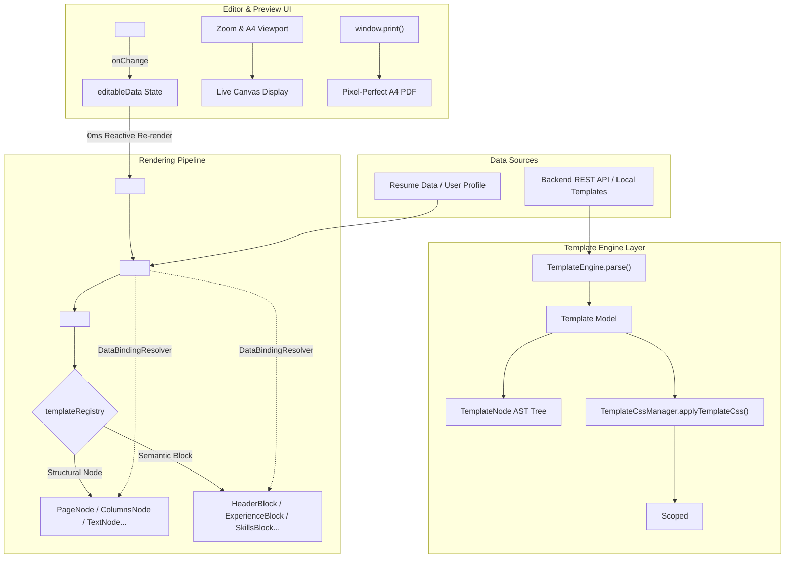

# Resume Template System Specification & API Reference

Comprehensive guide to template architecture, rendering engine, node & block logic, frontend editing, backend validation rules, and the complete zero-value field reference schema.

---

## 1. System Architecture & Rendering Engine

The FirstImpression template system is built upon a **declarative Abstract Syntax Tree (AST)** that completely separates resume content data, layout hierarchy, and scoped styling.

### 1.1 Architecture Flow



### 1.2 Core Engine Modules

1. **`TemplateEngine`** (`src/components/templates/engine/TemplateEngine.js`)
   - Normalizes raw JSON or objects into a typed `Template` model.
   - Depth-first AST tree walker (`traverse`).
   - Validates that the root node is of type `page` and ensures all node IDs are unique.

2. **`DataBindingResolver`** (`src/components/templates/engine/DataBindingResolver.js`)
   - Safely evaluates dot/bracket paths (e.g., `personal.name`, `experience[0].company`).
   - Resolves string interpolation tokens (e.g., `"{personal.city}, {personal.country}"`).
   - Evaluates whether a section has non-empty content before rendering (`hasContent`).

3. **`TemplateCssManager`** (`src/components/templates/engine/TemplateCssManager.js`)
   - Automatically prefixes CSS selectors with `.template-${slug}` to guarantee stylesheet isolation and prevent global style pollution.
   - Injects and manages `<style id="resume-template-style-[slug]">` elements dynamically in `document.head`.

---

## 2. Node & Block Systems

The layout tree is composed of **Structural Nodes** (which define flexbox/grid layout and typography) and **Semantic Blocks** (domain components that bind directly to resume data).

### 2.1 The 15 Allowed Node Types

| Node Type | Purpose | Key Attributes |
| :--- | :--- | :--- |
| `page` | Root sheet container simulating physical A4 (210mm $\times$ 297mm). | `id`, `children`, `classNames` |
| `columns` | Multi-column flexbox wrapper (`display: flex`). | `id`, `children`, `classNames` |
| `column` | Individual column flex child. | `id`, `config: { width }`, `children`, `classNames` |
| `container`| Generic `div` wrapper for layout grouping. | `id`, `children`, `classNames` |
| `row` | Flex row wrapper (`flex-direction: row`). | `id`, `children`, `classNames` |
| `section` | Logical container with `page-break-inside: avoid`. | `id`, `children`, `classNames` |
| `header` | Specialized container node for resume headers. | `id`, `children`, `classNames` |
| `block` | Bridge node that mounts a **Semantic Domain Block**. | `id`, `config: { blockType, title }`, `classNames` |
| `text` | Bound or static paragraph/span element. | `id`, `bind`, `text`, `config: { as }` |
| `heading` | Bound or static heading tag (`h1` through `h6`). | `id`, `bind`, `text`, `config: { level }` |
| `image` | Bound or static profile image / avatar. | `id`, `bind`, `config: { src, alt }` |
| `list` | Bulleted list wrapper (`<ul>`). | `id`, `children`, `classNames` |
| `item` | Individual bullet item (`<li>`). | `id`, `bind`, `text` |
| `divider` | Visual horizontal separating line (`<hr>`). | `id`, `classNames` |
| `spacer` | Vertical spacing element. | `id`, `config: { height }` |

### 2.2 The 9 Allowed Semantic Blocks (`type: "block"`)

| Block Type | Component | Data Bound | Configuration Options |
| :--- | :--- | :--- | :--- |
| `header` | `HeaderBlock` | `personal.name`, `title`, `email`, `phone`, `location`, `linkedin`, `github`, `website`, `photoUrl` | `showPhoto: boolean` |
| `summary` | `SummaryBlock` | `summary` or `personal.bio` | `title: string` |
| `experience` | `ExperienceBlock` | `experience` array (`role`, `company`, `location`, `startDate`, `endDate`, `highlights`) | `title: string` |
| `education` | `EducationBlock` | `education` array (`degree`, `institution`, `startDate`, `endDate`, `gpa`) | `title: string` |
| `skills` | `SkillsBlock` | `skills` (flat strings array or categorized `{ category, items }[]`) | `title: string` |
| `projects` | `ProjectsBlock` | `projects` array (`name`, `link`, `technologies`, `description`, `highlights`) | `title: string` |
| `certifications`| `CertificationsBlock` | `certifications` array (`name`, `issuer`, `date`, `url`) | `title: string` |
| `languages` | `LanguagesBlock` | `languages` array (`name`, `level`) | `title: string` |
| `custom` | `CustomBlock` | Custom user sections | `title: string` |

---

## 3. Frontend Display & Live Editing

### 3.1 Display & Print Simulation
- **A4 Physical Dimensions**: Base styles set `.resume-page` to `width: 210mm` and `min-height: 297mm`.
- **Zoom Stage**: The canvas is scaled using CSS transform:
  ```css
  transform: scale(zoomLevel / 100);
  transform-origin: top center;
  ```
- **Print & PDF Export**: `@page { size: A4 portrait; margin: 0; }` in `template-print.css` strips out shadows, transforms, and hides UI controls (`.print-hide`) to produce a 1:1 pixel-perfect PDF via `window.print()`.

### 3.2 Live Two-Way Editing
- **Reactivity**: `ResumeEditorPanel` sends updates through `onChange(updatedResumeData)`.
- **Zero-latency Re-render**: `TemplatesPage` maintains `editableData`. Updating state triggers immediate re-evaluation in `<TemplateRenderer>` without page reload.
- **Data Isolation**: Resume modifications are saved into `resumeDataJson` of that specific resume document. The user's root account profile remains untouched unless explicitly chosen.

---

## 4. Backend API & Validation Rules

### 4.1 Endpoints
- **Create Template**: `POST /api/templates`
- **Update Template**: `PUT /api/templates/{id}`
- **Get All Active**: `GET /api/templates/active`
- **Get by Slug**: `GET /api/templates/slug/{slug}`
- **Get CSS**: `GET /api/templates/{id}/css`
- **Get Structure**: `GET /api/templates/{id}/structure`

### 4.2 Top-Level Field Validation Rules
- **`name`**: Required, non-blank, max 150 characters.
- **`slug`**: Required, non-blank, max 150 characters, must match regex:
  `^[a-z0-9]+(?:-[a-z0-9]+)*$` (e.g., `modern-sidebar`, `minimal-two-col`).
- **`description`**: Optional, max 1000 characters.
- **`thumbnailUrl`**: Optional, max 500 characters.
- **`category`**: Optional, max 50 characters (e.g., `Modern`, `Minimal`, `Creative`, `Executive`).
- **`structureJson`**: Required, non-blank valid JSON string.
- **`cssText`**: Required, non-blank string, max 500,000 characters (500 KB).
- **`configJson`**: Optional valid JSON string.
- **`version`**: Integer, default 1.
- **`status`**: Boolean, default true.

### 4.3 AST Structure Validation Rules (`TemplateStructureValidator`)
1. Root node must be a JSON object with `"type": "page"`.
2. Maximum nesting depth is **20 levels**.
3. Every node must have a non-null `"type"` belonging to the allowed 15 types.
4. If `"type": "block"`, the `"block"` attribute or `config.blockType` must be one of the 9 allowed block types.
5. If `"children"` is present, it must be an array of valid node objects.
6. Every node should have a unique `"id"`.

### 4.4 CSS Security & Syntax Rules (`TemplateCssValidator`)
- **Max length**: 500 KB (500,000 characters).
- **Dangerous syntax is strictly blocked**:
  - `<script`
  - `javascript:` or `vbscript:`
  - `expression(...)`
  - `behavior:` or `-moz-binding:`
  - `@import` (prevents external stylesheet injection)
- **Scoping**: All rules must be scoped under `.template-${slug}` (or will be automatically scoped by `TemplateCssManager`).

---

## 5. Complete Zero-Value API Reference Template

Use the following boilerplate when creating new templates. All fields, node types, block types, configuration options, and CSS target classes are included with empty or zero-value placeholders.

### 5.1 Top-Level API JSON Payload (`POST /api/templates`)

```json
{
  "name": "",
  "slug": "",
  "description": "",
  "thumbnailUrl": "",
  "category": "",
  "version": 1,
  "status": true,
  "configJson": "{\"pageSize\":\"\",\"orientation\":\"\",\"margins\":{\"top\":\"\",\"right\":\"\",\"bottom\":\"\",\"left\":\"\"},\"fontFamily\":\"\",\"colors\":{\"primary\":\"\",\"secondary\":\"\",\"accent\":\"\",\"background\":\"\",\"text\":\"\"}}",
  "structureJson": "",
  "cssText": ""
}
```

---

### 5.2 Complete Zero-Value `configJson` Reference

```json
{
  "pageSize": "",
  "orientation": "",
  "margins": {
    "top": "",
    "right": "",
    "bottom": "",
    "left": ""
  },
  "fontFamily": "",
  "fontSize": {
    "base": "",
    "heading": "",
    "subheading": "",
    "caption": ""
  },
  "colors": {
    "primary": "",
    "primaryLight": "",
    "secondary": "",
    "accent": "",
    "accentLight": "",
    "background": "",
    "surface": "",
    "text": "",
    "textMuted": "",
    "border": ""
  }
}
```

---

### 5.3 Complete Zero-Value `structureJson` Reference (All Node & Block Types)

```json
{
  "id": "page-root",
  "type": "page",
  "classNames": "",
  "config": {},
  "children": [
    {
      "id": "node-header-container",
      "type": "header",
      "classNames": "",
      "config": {},
      "children": [
        {
          "id": "block-header",
          "type": "block",
          "classNames": "",
          "config": {
            "blockType": "header",
            "showPhoto": true
          }
        }
      ]
    },
    {
      "id": "node-divider-top",
      "type": "divider",
      "classNames": "",
      "config": {}
    },
    {
      "id": "node-spacer-top",
      "type": "spacer",
      "classNames": "",
      "config": {
        "height": ""
      }
    },
    {
      "id": "node-columns-layout",
      "type": "columns",
      "classNames": "",
      "config": {},
      "children": [
        {
          "id": "node-column-sidebar",
          "type": "column",
          "classNames": "",
          "config": {
            "width": ""
          },
          "children": [
            {
              "id": "node-section-summary",
              "type": "section",
              "classNames": "",
              "config": {},
              "children": [
                {
                  "id": "block-summary",
                  "type": "block",
                  "classNames": "",
                  "config": {
                    "blockType": "summary",
                    "title": ""
                  }
                }
              ]
            },
            {
              "id": "node-section-skills",
              "type": "section",
              "classNames": "",
              "config": {},
              "children": [
                {
                  "id": "block-skills",
                  "type": "block",
                  "classNames": "",
                  "config": {
                    "blockType": "skills",
                    "title": ""
                  }
                }
              ]
            },
            {
              "id": "node-section-languages",
              "type": "section",
              "classNames": "",
              "config": {},
              "children": [
                {
                  "id": "block-languages",
                  "type": "block",
                  "classNames": "",
                  "config": {
                    "blockType": "languages",
                    "title": ""
                  }
                }
              ]
            },
            {
              "id": "node-section-custom",
              "type": "section",
              "classNames": "",
              "config": {},
              "children": [
                {
                  "id": "block-custom",
                  "type": "block",
                  "classNames": "",
                  "config": {
                    "blockType": "custom",
                    "title": ""
                  }
                }
              ]
            }
          ]
        },
        {
          "id": "node-column-main",
          "type": "column",
          "classNames": "",
          "config": {
            "width": ""
          },
          "children": [
            {
              "id": "node-section-experience",
              "type": "section",
              "classNames": "",
              "config": {},
              "children": [
                {
                  "id": "block-experience",
                  "type": "block",
                  "classNames": "",
                  "config": {
                    "blockType": "experience",
                    "title": ""
                  }
                }
              ]
            },
            {
              "id": "node-section-education",
              "type": "section",
              "classNames": "",
              "config": {},
              "children": [
                {
                  "id": "block-education",
                  "type": "block",
                  "classNames": "",
                  "config": {
                    "blockType": "education",
                    "title": ""
                  }
                }
              ]
            },
            {
              "id": "node-section-projects",
              "type": "section",
              "classNames": "",
              "config": {},
              "children": [
                {
                  "id": "block-projects",
                  "type": "block",
                  "classNames": "",
                  "config": {
                    "blockType": "projects",
                    "title": ""
                  }
                }
              ]
            },
            {
              "id": "node-section-certifications",
              "type": "section",
              "classNames": "",
              "config": {},
              "children": [
                {
                  "id": "block-certifications",
                  "type": "block",
                  "classNames": "",
                  "config": {
                    "blockType": "certifications",
                    "title": ""
                  }
                }
              ]
            }
          ]
        }
      ]
    },
    {
      "id": "node-container-footer",
      "type": "container",
      "classNames": "",
      "config": {},
      "children": [
        {
          "id": "node-row-elements",
          "type": "row",
          "classNames": "",
          "config": {},
          "children": [
            {
              "id": "node-custom-heading",
              "type": "heading",
              "bind": "",
              "text": "",
              "classNames": "",
              "config": {
                "level": 2
              }
            },
            {
              "id": "node-custom-text",
              "type": "text",
              "bind": "",
              "text": "",
              "classNames": "",
              "config": {
                "as": "p"
              }
            },
            {
              "id": "node-custom-image",
              "type": "image",
              "bind": "",
              "classNames": "",
              "config": {
                "src": "",
                "alt": ""
              }
            },
            {
              "id": "node-custom-list",
              "type": "list",
              "classNames": "",
              "config": {},
              "children": [
                {
                  "id": "node-custom-item",
                  "type": "item",
                  "bind": "",
                  "text": "",
                  "classNames": "",
                  "config": {}
                }
              ]
            }
          ]
        }
      ]
    }
  ]
}
```

---

### 5.4 Complete Zero-Value `cssText` Reference (All Classes & Selectors)

Replace `<slug>` with your template's slug (e.g. `modern-sidebar`).

```css
/* ==========================================================================
   Template Root & Design Tokens
   ========================================================================== */
.template-<slug> {
  --primary: ;
  --primary-light: ;
  --secondary: ;
  --accent: ;
  --accent-light: ;
  --text-main: ;
  --text-muted: ;
  --bg-page: ;
  --bg-sidebar: ;
  --border-color: ;
  --font-family: ;

  font-family: var(--font-family, inherit);
  color: var(--text-main, #1e293b);
  background-color: var(--bg-page, #ffffff);
}

/* ==========================================================================
   Page & Base Structural Layout
   ========================================================================== */
.template-<slug> .resume-page {
  width: 210mm;
  min-height: 297mm;
  box-sizing: border-box;
  padding: ;
  margin: 0 auto;
}

.template-<slug> .resume-container {
  width: 100%;
  box-sizing: border-box;
}

.template-<slug> .resume-row {
  display: flex;
  flex-direction: row;
  width: 100%;
  gap: ;
}

.template-<slug> .resume-columns {
  display: flex;
  width: 100%;
}

.template-<slug> .resume-column {
  display: flex;
  flex-direction: column;
  min-width: 0;
}

.template-<slug> .resume-section {
  display: flex;
  flex-direction: column;
  page-break-inside: avoid;
  break-inside: avoid;
  margin-bottom: ;
}

.template-<slug> .resume-divider {
  width: 100%;
  border: none;
  border-top: ;
  margin: ;
}

.template-<slug> .resume-spacer {
  width: 100%;
}

/* ==========================================================================
   Header Block Components
   ========================================================================== */
.template-<slug> .block-header {
  display: flex;
}

.template-<slug> .header-container {
  display: flex;
  gap: ;
}

.template-<slug> .header-photo-container {
}

.template-<slug> .avatar-img,
.template-<slug> .header-photo {
  width: ;
  height: ;
  border-radius: ;
  object-fit: cover;
  border: ;
}

.template-<slug> .header-text-group {
}

.template-<slug> .candidate-name,
.template-<slug> .header-name {
  font-size: ;
  font-weight: ;
  color: ;
  margin: ;
}

.template-<slug> .candidate-title,
.template-<slug> .header-role {
  font-size: ;
  font-weight: ;
  color: ;
  margin: ;
}

.template-<slug> .candidate-contact,
.template-<slug> .header-contacts {
  display: flex;
  flex-wrap: wrap;
  gap: ;
  font-size: ;
  color: ;
}

.template-<slug> .contact-item,
.template-<slug> .header-contact-item {
  display: inline-flex;
  align-items: center;
  gap: ;
}

.template-<slug> .contact-item a {
  color: inherit;
  text-decoration: none;
}

/* ==========================================================================
   Section Headings
   ========================================================================== */
.template-<slug> .block-section-title {
  font-size: ;
  font-weight: ;
  text-transform: ;
  letter-spacing: ;
  color: ;
  border-bottom: ;
  padding-bottom: ;
  margin-bottom: ;
}

/* ==========================================================================
   Summary Block
   ========================================================================== */
.template-<slug> .block-summary {
}

.template-<slug> .summary-text {
  font-size: ;
  line-height: ;
  color: ;
}

/* ==========================================================================
   Timeline Items (Experience, Education, Projects, Certifications)
   ========================================================================== */
.template-<slug> .timeline-item,
.template-<slug> .experience-item,
.template-<slug> .education-item,
.template-<slug> .project-item,
.template-<slug> .certification-item {
  margin-bottom: ;
}

.template-<slug> .timeline-header,
.template-<slug> .item-header {
  display: flex;
  justify-content: space-between;
  align-items: baseline;
}

.template-<slug> .timeline-title,
.template-<slug> .item-title {
  font-size: ;
  font-weight: ;
  color: ;
}

.template-<slug> .timeline-subtitle,
.template-<slug> .item-subtitle {
  font-size: ;
  font-weight: ;
  color: ;
}

.template-<slug> .timeline-separator {
  color: ;
}

.template-<slug> .timeline-meta {
  display: flex;
  align-items: center;
  gap: ;
}

.template-<slug> .timeline-date,
.template-<slug> .item-date {
  font-size: ;
  color: ;
}

.template-<slug> .timeline-location,
.template-<slug> .item-location {
  font-size: ;
  color: ;
}

.template-<slug> .timeline-description,
.template-<slug> .item-description {
  font-size: ;
  color: ;
  line-height: ;
  margin-top: ;
}

.template-<slug> .timeline-highlights,
.template-<slug> .bullet-list {
  padding-left: ;
  margin: ;
}

.template-<slug> .timeline-highlights li,
.template-<slug> .bullet-list li {
  font-size: ;
  color: ;
  line-height: ;
  margin-bottom: ;
}

/* ==========================================================================
   Skills Block & Badges
   ========================================================================== */
.template-<slug> .block-skills {
}

.template-<slug> .skills-grouped {
}

.template-<slug> .skill-group {
  margin-bottom: ;
}

.template-<slug> .skill-group-name {
  font-size: ;
  font-weight: ;
  color: ;
  margin-bottom: ;
}

.template-<slug> .skills-list {
  display: flex;
  flex-wrap: wrap;
  gap: ;
  list-style: none;
  padding: 0;
  margin: 0;
}

.template-<slug> .skill-tag,
.template-<slug> .skill-badge {
  display: inline-block;
  font-size: ;
  font-weight: ;
  color: ;
  background-color: ;
  border: ;
  border-radius: ;
  padding: ;
}

/* ==========================================================================
   Languages Block
   ========================================================================== */
.template-<slug> .block-languages {
}

.template-<slug> .languages-list {
}

.template-<slug> .language-item {
  display: flex;
  justify-content: space-between;
  margin-bottom: ;
}

.template-<slug> .language-name {
  font-weight: ;
  font-size: ;
}

.template-<slug> .language-level {
  font-size: ;
  color: ;
}

/* ==========================================================================
   Primitive Typography & Content Elements
   ========================================================================== */
.template-<slug> .resume-heading {
  margin: 0;
  font-weight: ;
  line-height: ;
}

.template-<slug> .resume-text {
  margin: 0;
  line-height: ;
}

.template-<slug> .resume-image-container {
  display: inline-block;
}

.template-<slug> .resume-image {
  max-width: 100%;
  height: auto;
  display: block;
}

.template-<slug> .resume-list {
  padding-left: ;
  margin: ;
}

.template-<slug> .resume-item {
  margin-bottom: ;
}
```

---

### 5.5 Complete Zero-Value Profile Information / Resume Data JSON Reference

Universal data schema consumed by `<TemplateRenderer>` and bound to Semantic Blocks (`HeaderBlock`, `ExperienceBlock`, etc.) and AST Nodes (`bind: "personal.email"`, etc.). Contains all supported personal details, career collections, and metadata with zero/empty values:

```json
{
  "personal": {
    "name": "",
    "fullName": "",
    "title": "",
    "jobTitle": "",
    "email": "",
    "phone": "",
    "location": "",
    "city": "",
    "country": "",
    "linkedin": "",
    "github": "",
    "website": "",
    "portfolio": "",
    "photoUrl": "",
    "avatar": "",
    "bio": ""
  },
  "summary": "",
  "experience": [
    {
      "id": "",
      "role": "",
      "title": "",
      "position": "",
      "company": "",
      "employer": "",
      "location": "",
      "startDate": "",
      "endDate": "",
      "current": false,
      "description": "",
      "highlights": [
        ""
      ]
    }
  ],
  "education": [
    {
      "id": "",
      "degree": "",
      "fieldOfStudy": "",
      "major": "",
      "institution": "",
      "school": "",
      "college": "",
      "location": "",
      "startDate": "",
      "endDate": "",
      "gpa": "",
      "highlights": [
        ""
      ]
    }
  ],
  "skills": [
    {
      "category": "",
      "items": [
        ""
      ]
    }
  ],
  "projects": [
    {
      "id": "",
      "name": "",
      "title": "",
      "link": "",
      "url": "",
      "technologies": [
        ""
      ],
      "startDate": "",
      "endDate": "",
      "description": "",
      "highlights": [
        ""
      ]
    }
  ],
  "certifications": [
    {
      "id": "",
      "name": "",
      "title": "",
      "issuer": "",
      "organization": "",
      "date": "",
      "url": ""
    }
  ],
  "languages": [
    {
      "name": "",
      "language": "",
      "level": "",
      "proficiency": ""
    }
  ],
  "custom": [
    {
      "id": "",
      "title": "",
      "description": "",
      "items": [
        ""
      ]
    }
  ]
}
```

